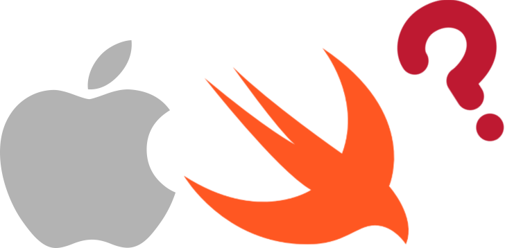

<div id="top"></div>

<div align="center">
	
	<h1 align="center">iOS Interview Questions</h1>
	<p align="center">A compilation of 151 commonly asked <a href="https://www.hackingwithswift.com/interview-questions" target="_blank">interview questions</a> for iOS developers with their respective answer.</p>
	<p>
		<a href="https://github.com/HenestrosaDev/ios-interview-questions/stargazers">
			
		</a>
		<a href="https://github.com/HenestrosaDev/ios-interview-questions/graphs/contributors">
			
		</a>
		<a href="https://github.com/HenestrosaDev/ios-interview-questions/issues">
			
		</a>
		<a href="https://github.com/HenestrosaDev/ios-interview-questions/pulls">
			
		</a>
		<a href="https://github.com/HenestrosaDev/ios-interview-questions/blob/main/LICENSE">
			
		</a>
	</p>
	<p>
		<a href="https://github.com/HenestrosaDev/ios-interview-questions/issues/new/choose">Report Issue</a> · <a href="https://github.com/HenestrosaDev/ios-interview-questions/discussions">Ask Question</a>
	</p>
</div> 

## Table of Contents

- [Before You Start](#before-you-start)
- Question Categories
	- [Accessibility](#accessibility)
	- [Data](#data)
	- [Design Patterns](#design-patterns)
	- [Frameworks](#frameworks)
	- [iOS](#ios)
	- [Miscellaneous](#miscellaneous)
	- [Performance](#performance)
	- [Security](#security)
	- [Swift](#swift)
	- [SwiftUI](#swiftui)
	- [UIKit](#uikit)
- [License](#license)
- [Authors](#authors)
- [Support](#support)

## Before You Start

- Questions taken from [hackingwithswift.com](https://www.hackingwithswift.com/interview-questions) and answered by me with the help of [Swift Book](https://docs.swift.org/swift-book/documentation/the-swift-programming-language/), [Hacking with Swift](https://www.hackingwithswift.com/), [StackOverflow](https://www.stackoverflow.com/) and [ChatGPT](https://chat.openai.com/).

- These colors indicate the difficulty level of the questions:
	- 🟩 Beginner question
	- 🟧 Intermediate question
	- 🟥 Advanced question

- I've made a blog post with all the contents of this file on [my website](https://henestrosa.dev/blog/151-ios-interview-questions/).

---

## Accessibility

- 🟩 [How much experience do you have testing with VoiceOver?](https://www.hackingwithswift.com/interview-questions/how-much-experience-do-you-have-testing-with-voiceover)
	<details>
		<summary>Answer</summary>
	
	The answer depends on your experience with VoiceOver. Here is how I would approach it:
 
	>I would say that I have a fair amount of experience testing with VoiceOver. It is an essential part of making sure that an iOS app is accessible to all users, including those who are visually impaired. To test with VoiceOver, the developer can enable VoiceOver on their test device and navigate through the app using only VoiceOver. This involves listening to the VoiceOver descriptions of each element on the screen and verifying that they are accurate and meaningful.
	>
	>For example, when testing a button, the developer would want to ensure that VoiceOver correctly reads out the label of the button and provides any necessary contextual information. They would also want to verify that the button is in the correct order in the navigation flow and that it can be activated using only voice commands.
	>
	>Testing with VoiceOver can be time-consuming, but it is an essential step in creating an accessible app. By testing with VoiceOver, developers can ensure that their app is easy to use for all users, regardless of their visual abilities.
	</details>

- 🟩 [How would you explain Dynamic Type to a new iOS developer?](https://www.hackingwithswift.com/interview-questions/how-would-you-explain-dynamic-type-to-a-new-ios-developer)
	<details>
		<summary>Answer</summary>
	
	Dynamic Type is a feature in iOS that allows users to adjust the font size of text displayed in apps. It gives users the ability to increase or decrease the size of the text to make it easier to read, and it also helps to ensure that text is legible for people with visual impairments.

	We can use Dynamic Type to make an app more accessible and user-friendly. Instead of specifying a fixed font size for the text, we can use Dynamic Type to allow the user's preferred text size to be applied throughout an app. We can do this by using font size constants that are tied to the user's preferred text size setting, such as `UIFontTextStyleBody` or `UIFontTextStyleHeadline`.
	</details>

- 🟩 [What are the main problems we need to solve when making accessible apps?](https://www.hackingwithswift.com/interview-questions/what-are-the-main-problems-we-need-to-solve-when-making-accessible-apps)
	<details>
		<summary>Answer</summary>

	When making accessible apps, the main problems we need to solve are:

	- **Providing sufficient visual and auditory cues**: This includes ensuring that visual elements such as text, buttons, and icons are clear and easy to read, and that auditory elements such as sound effects and voiceovers are clear and easily distinguishable.
	- **Supporting assistive technologies**: This involves ensuring that our app is compatible with screen readers, such as VoiceOver, and other assistive technologies that people with disabilities may rely on to interact with their devices.
	- **Providing alternative input methods**: Some people may not be able to use a touchscreen, so it's important to provide alternative input methods such as voice commands or keyboard navigation.
	- **Ensuring that our app is keyboard accessible**: This means that all functionality within our app can be accessed using only the keyboard.
	- **Providing sufficient color contrast**: People with visual impairments may have difficulty distinguishing between certain colors, so it's important to ensure that our app provides sufficient color contrast for all text and visual elements.
	- **Making sure that our app is usable for everyone**: Accessibility is not just about accommodating people with disabilities, but also about ensuring that our app is usable for everyone, regardless of their abilities or limitations. This means designing our app with clear and intuitive navigation, simple and easy-to-use interfaces, and avoiding the use of complex or confusing gestures.
	</details>

- 🟧 [What accommodations have you added to apps to make them more accessible?](https://www.hackingwithswift.com/interview-questions/what-accommodations-have-you-added-to-apps-to-make-them-more-accessible)
	<details>
		<summary>Answer</summary>

	The answer depends on your experience with adding accommodations to make apps more accessible. Here is how I would approach it:
	
	>- **Implementing Dynamic Type**: This allows users to adjust the font size in the app to better suit their needs.
	>- **Providing alternative text for images**: This allows users with visual impairments to understand the content of the app.
	>- **Using VoiceOver**: This allows users to interact with the app using spoken feedback and gestures.
	>- **Adding closed captions**: This allows users with hearing impairments to understand the audio content in the app.
	>- **Making sure the app is navigable with a keyboard**: This allows users with motor impairments to use the app without a touchscreen.
	>- **Ensuring good color contrast**: This allows users with visual impairments to distinguish between different elements in the app.
	</details>

<p align="right">(<a href="#top">back to top</a>)</p>

## Data

- 🟩 [How is a dictionary different from an array?](https://www.hackingwithswift.com/interview-questions/how-is-a-dictionary-different-from-an-array)
	<details>
		<summary>Answer</summary>
	
	In Swift, an array is an ordered collection of values of the same type, while a dictionary is an unordered collection of key-value pairs.

	In an array, each element is accessed by its index, which is an integer starting from zero. The order of the elements in the array is determined by their position in the array.

	In a dictionary, each value is associated with a unique key, which can be of any hashable type, such as a string or an integer. Keys are used to look up values in the dictionary, rather than indices. Unlike arrays, the order of the elements in a dictionary is not guaranteed.
	</details> 

- 🟩 [What are the main differences between classes and structs in Swift?](https://www.hackingwithswift.com/interview-questions/what-are-the-main-differences-between-classes-and-structs-in-swift)
	<details>
		<summary>Answer</summary>

	In Swift, both classes and structs are used to define custom data types. While they share many similarities, there are some key differences between them:

	- **Inheritance**: A class can inherit from another class, but a struct cannot. This means that classes can build on the functionality of other classes, while structs are limited to their own implementation.
	- **Reference vs Value Types**: When we pass a class instance to a function or assign it to a new variable, we're creating a reference to that instance. This means that any changes made to the instance will be reflected across all references to it. On the other hand, when we pass a struct instance or assign it to a new variable, we're creating a copy of that instance. Any changes made to the copy will not affect the original instance. This can make structs more predictable and less prone to bugs, but also less flexible. **Note that a struct instance can be modified when passed to a function if the parameter is defined with the `inout` keyword, meaning that it can be modified inside the function, and those modifications will be reflected in the original value outside the function**.
	- **Mutability**: In general, classes are more flexible and mutable than structs. We can add and remove properties and methods from a class at runtime, while a struct's properties and methods are fixed at compile time.
	- **Initialization**: Structs have member-wise initializers automatically generated for them by default, while classes do not. This means that when we create a new instance of a struct, we can pass in all of its properties as arguments to the initializer. With classes, we need to define our own initializer(s) to achieve the same effect.
	- **Memory management**: Classes are managed by reference counting, meaning that instances are deallocated when their reference count drops to zero. Structs, on the other hand, are copied by value, and their lifetimes are determined by the scope in which they're defined.
	<br />

	In general, we should choose classes when we need the features they provide, such as inheritance or reference types, and choose structs when we want to take advantage of their predictability, immutability, and value semantics.
	</details> 

- 🟩 [What are tuples and why are they useful?](https://www.hackingwithswift.com/interview-questions/what-are-tuples-and-why-are-they-useful)
	<details>
		<summary>Answer</summary>

	In Swift, tuples are a lightweight way to group multiple values into a single compound value. A tuple can contain two or more values of any type, including other tuples. They are useful when we want to pass around a single value that consists of multiple values, and creating a separate custom data structure would be overkill. In a sense, they are like anonymous structs.

	One of the primary benefits of tuples is that they allow us to group together a small number of related values in a concise and expressive way. For example, we could use a tuple to represent a point in two-dimensional space with an x-coordinate and y-coordinate. Instead of defining a custom class or struct to hold these two values, we can use a tuple with two elements, like this:

	```swift
	let point = (x: 10, y: 20)
	```
	
	Another use case for tuples is when we want to return multiple values from a function, but we don't want to define a custom data structure to hold those values. Tuples provide a lightweight and easy way to return multiple values as a single compound value. For example:

	```swift
	func calculateMinMax(numbers: [Int]) -> (min: Int, max: Int)? {
		guard let first = numbers.first else {
			return nil
		}

		var min = first
		var max = first

		for number in numbers {
			if number < min {
				min = number
			} else if number > max {
				max = number
			}
		}
		return (min, max)
	}
	```
	
	In this example, the `calculateMinMax` function returns a tuple with two values: the minimum and maximum values in an array of integers. The tuple is marked as optional, in case the input array is empty.
	</details>

- 🟩 [What does the `Codable` protocol do?](https://www.hackingwithswift.com/interview-questions/what-does-the-codable-protocol-do)
	<details>
		<summary>Answer</summary>

	The `Codable` protocol is is a type-safe way to encode and decode data to and from different formats, such as JSON or property list (plist). It is a type alias that combines the `Encodable` and `Decodable` protocols.

	By conforming to the `Codable` protocol, a Swift type can be encoded to a binary or textual format that can be sent over a network or saved to disk, and then decoded back into a Swift object. This makes it easy to work with data from external sources such as web APIs, databases, and file systems.

	This protocol also eliminates the need to write custom serialization and deserialization code, although it's still an option if needed. Such tasks can be time-consuming and error-prone. Instead, the Swift compiler automatically generates the necessary code based on the structure of the type being encoded or decoded.
	</details>

- 🟩 [What is the difference between an array and a set?](https://www.hackingwithswift.com/interview-questions/what-is-the-difference-between-an-array-and-a-set)
	<details>
		<summary>Answer</summary>

	In Swift, an array is an ordered collection of values of the same type, whereas a set is an unordered collection of unique values of the same type.

	Here are some key differences:

	- **Order**: Arrays have a specific order, and the elements in an array are accessed using their index, whereas sets are unordered, and the elements in a set are accessed using their value.
	- **Duplicates**: Arrays can contain duplicate values, whereas sets only contain unique values.
	- **Performance**: Sets are optimized for fast membership testing, which means that they are typically faster than arrays when checking whether an element exists in the collection. However, sets are typically slower than arrays when accessing elements by index.
	<br />

	We can convert an array to a set and vice versa. However, when we convert an array to a set, we have to keep in mind that we lose both the order of the elements and the duplicate elements. Also, if we want to store custom data types in a set, we need to make sure that it conforms to the `Hashable` protocol, which ensures a consistent way of generating hash values and checking for equality, so that duplicate objects aren't accidentally added.
	</details>

- 🟩 [What is the difference between the `Float`, `Double`, and `CGFloat` data types?](https://www.hackingwithswift.com/interview-questions/what-is-the-difference-between-the-float-double-and-cgfloat-data-types)
	<details>
		<summary>Answer</summary>
	
	In Swift, `Float` and `Double` are floating-point data types used to represent decimal values with a limited and extended precision, respectively. The `CGFloat` data type is used in UIKit and Core Graphics frameworks, and it represents a floating-point value with a precision equivalent to the platform's native `Float` type on 32-bit platforms and `Double` type on 64-bit platforms.

	The main difference between `Float` and `Double` is their precision. Float has a precision of 32-bit, while `Double` has a precision of 64-bit. This means that `Double` can represent larger and more precise values than `Float`.

	On the other hand, `CGFloat` is a type alias defined by Apple that can represent floating-point values with the same precision as the platform's native `Float` or `Double` type. `CGFloat` is often used in Core Graphics and UIKit frameworks for graphics-related calculations and drawing operations.
	</details>

- 🟩 [What's the importance of key decoding strategies when using `Codable`?](https://www.hackingwithswift.com/interview-questions/whats-the-importance-of-key-decoding-strategies-when-using-codable)
	<details>
		<summary>Answer</summary>

	They are essential because they allow us to map the keys of our JSON (or other data formats) to the Swift properties of our structs or classes. This is crucial because the keys of our JSON may not match the property names we want to use in our Swift code.

	There are several key decoding strategies available in Swift, including:

	- `useDefaultKeys`: This strategy uses the property names as the keys in the JSON.
	- `convertFromSnakeCase`: This strategy converts keys in the JSON from snake_case to camelCase.
	- `custom`: This strategy allows us to define our own key mapping using a closure.
	<br />

	Using the correct key decoding strategy is important because it ensures that our data is decoded correctly into our Swift objects, which can help prevent bugs and ensure that our app works as expected.
	</details>

- 🟩 [When using arrays, what's the difference between `map()` and `compactMap()`?](https://www.hackingwithswift.com/interview-questions/when-using-arrays-whats-the-difference-between-map-and-compactmap)
	<details>
		<summary>Answer</summary>

	Both `map()` and `compactMap()` are higher-order functions available for types that conform to the `Sequence` protocol in Swift (e.g., arrays and sets). Both take a closure as an argument and apply the closure to each element of the array. However, the `map()` function returns an array with the transformed elements, while `compactMap()` returns an array with the non-nil transformed elements. Therefore, `compactMap()` is useful when we want to transform elements of an array that may have `nil` values and remove them from the result.

	Here's an example:

	```swift
	let numbers = ["1", "2", "3", "four", "5"]

	// Using map() to convert the string numbers to integers
	let mapped = numbers.map { Int($0) } // [1, 2, 3, nil, 5]

	// Using compactMap() to convert the string numbers to integers and remove the nil value
	let compactMapped = numbers.compactMap { Int($0) } // [1, 2, 3, 5]
	```
	
	In the example above, the `map()` function is used to convert each string element of the `numbers` array to an integer. However, since `"four"` cannot be converted to an integer, it is returned as `nil`. The resulting array from `map()` contains `nil` for the `"four"`, so its type is `[Int?]`. On the other hand, `compactMap()` is used to convert each string element to an integer and remove the `nil` values. The resulting array from `compactMap()` only contains integers, so its type is `[Int]`.
	</details>

- 🟩 [Why is immutability important?](https://www.hackingwithswift.com/interview-questions/why-is-immutability-important)
	<details>
		<summary>Answer</summary>

	Immutability is important for the following reasons:

	- **Avoiding unintended changes**: When a variable or object is mutable, it can be changed at any time, leading to unintended changes that can cause bugs and errors. By making variables and objects immutable, we can avoid such unintended changes.
	- **Thread safety**: Immutable objects are inherently thread-safe, as they cannot be changed by multiple threads simultaneously. This can make concurrent programming much easier and less error-prone.
	- **Clarity and simplicity**: When objects are immutable, it is clear that their state cannot change, which can make code easier to reason about and understand. Immutability can also simplify certain algorithms and data structures, such as functional programming techniques.
	- **Performance**: In some cases, immutable data structures can be more performant than mutable ones. This is because they do not need to perform additional checks and operations to ensure their state is consistent.
	<br />
	</details> 

- 🟧 [What are one-sided ranges and when would you use them?](https://www.hackingwithswift.com/interview-questions/what-are-one-sided-ranges-and-when-would-you-use-them)
	<details>
		<summary>Answer</summary>
	
	One-sided ranges are a feature introduced in Swift 4 that allow us to create a range that includes all elements from a starting index or up to an ending index. I would use them to perform operations on collections, such as slicing arrays, iterating over subsets, or working with substrings, without having to explicitly define both endpoints.

	The syntax for a one-sided range is either `..<`, `start...`, or `...end`. The `..<` operator creates a range that **does not include** the value of the right operand, while the `...` operator creates a range that **includes** the value of the right/left operand.

	For example, if we have an array `numbers` with 5 elements, we can use a one-sided range to access a subset of the elements:

	```swift
	let numbers = [1, 2, 3, 4, 5]

	// access elements from index 2 to the end
	let subset1 = numbers[2...]
	// subset1 is [3, 4, 5]

	// access elements up to index 3
	let subset2 = numbers[..<3]
	// subset2 is [1, 2, 3]
	```
 	</details> 

- 🟧 [What does it mean when we say “strings are collections in Swift”?](https://www.hackingwithswift.com/interview-questions/what-does-it-mean-when-we-say-strings-are-collections-in-swift)
	<details>
		<summary>Answer</summary>

	In Swift, a `String` is a collection type, which means that it can be treated as a sequence of individual elements, or characters, that can be iterated over using various methods, such as loops and higher-order functions like `map`, `filter`, and `reduce`. This is because, under the hood, a `String` is represented by a collection of `Character` values, each of which represents a single Unicode character.

	As a collection, a `String` has several useful properties and methods inherited from the `Collection` protocol, including `count`, `isEmpty`, and `first`, as well as subscripting using integer indices or ranges. Additionally, `String` also provides many specific methods for working with strings, such as `hasPrefix`, `hasSuffix`, and `replacingOccurrences`, which makes it easier to manipulate and transform string values in various ways.
	</details> 

- 🟧 [What is a `UUID`, and when might you use it?](https://www.hackingwithswift.com/interview-questions/what-is-a-uuid-and-when-might-you-use-it)
	<details>
		<summary>Answer</summary>

	`UUID` stands for Universally Unique Identifier. It is a 128-bit value that is used to identify _almost unique_ objects, resources, or entities in a system or application where uniqueness is important, such as distributed systems, databases, or file systems.

	They are _almost unique_ because there exists a probability of generating two identical UUIDs, although it's extremely small and depends on the number of entities created and the speed at which we create them.

	In Swift, the `UUID` class is used to generate UUIDs. We can use UUIDs in a variety of situations where we need a unique identifier, such as:

	- To identify objects or resources in a distributed system where multiple nodes need to access the same resource.
	- To create unique identifiers for user accounts or other entities in a database.
	- To generate unique filenames or file IDs in a file system.
	- To track application usage or events in analytics.
	- To prevent collisions when generating random numbers.
	</details> 

- 🟧 [What's the difference between a value type and a reference type?](https://www.hackingwithswift.com/interview-questions/whats-the-difference-between-a-value-type-and-a-reference-type)
	<details>
		<summary>Answer</summary>

	In Swift, value types and reference types are two fundamental ways in which data is managed in memory. They differ in how they handle assignment, copying, and reference sharing.

	A **value type** creates a new copy of its data when it is assigned to a variable, or passed to a function. Changes to one instance of a value type do not affect other instances.

	Value types in Swift include basic data types like `Int`, `Double`, `Bool`, and `String`, as well as more complex types such as structs and enums. Here is an example:

	```swift
	struct Point {
		var x: Int
		var y: Int
	}
	
	var point1 = Point(x: 1, y: 2)
	var point2 = point1  // Creates a copy of `point1`
	point2.x = 10        // Modifying `point2` does not affect `point1`
	
	print(point1.x)  // Output: 1
	print(point2.x)  // Output: 10
 	```

	However, value types can be modified from a function if the parameter is defined with the `inout` keyword. Those modifications will be reflected in the original value outside the function. For example, if you want to double a number in place—i.e., change the value directly rather than returning a new one—you might write a function like this:

  	```swift
	func doubleInPlace(number: inout Int) {
		number *= 2
	}
   	```

   	To use it, you first need to make a variable integer—you can't use constant integers with `inout`, because they might get changed. You also need to pass the parameter to `doubleInPlace` using an ampersand, `&`, before its name, which is an explicit recognition that you know it's being used as `inout`.

  	```swift
	var myNum = 10 
	doubleInPlace(number: &myNum)
   	```

	On the other hand, a **reference type** include classes, functions, and closures. It doesn't create a copy when assigned to a new variable or passed to a function. Instead, it creates a new reference (or pointer) to the same instance in memory. Changes to one reference affect all references.

	```swift
	class Point {
		var x: Int
		var y: Int
		
		init(x: Int, y: Int) {
			self.x = x
			self.y = y
		}
	}
	
	var point1 = Point(x: 1, y: 2)
	var point2 = point1  // Both `point1` and `point2` reference the same instance
	point2.x = 10        // Modifying `point2` also affects `point1`
	
	print(point1.x)  // Output: 10
	print(point2.x)  // Output: 10
 	```
	</details> 

- 🟧 [When would you use Swift's `Result` type?](https://www.hackingwithswift.com/interview-questions/when-would-you-use-swifts-result-type)
	<details>
		<summary>Answer</summary>

	Swift's `Result` type is a generic enumeration that represents the success or failure of an operation. It is commonly used for handling asynchronous tasks or error-prone operations in a concise, expressive, and type-safe way.

	For example, we might use `Result` when making a network request. The successful result would be the data received from the network request, while the failure result would be an error that occurred during the request (e.g. a timeout, network error, or invalid response). Here is an example:

	```swift
	enum NetworkError: Error {
		case badURL
		case requestFailed
		case unknown
	}

 	// Network request
	func fetchData(from url: String, completion: (Result<Data, NetworkError>) -> Void) {
		guard let url = URL(string: url) else {
			completion(.failure(.badURL))
			return
		}
		
		URLSession.shared.dataTask(with: url) { data, response, error in
			if let _ = error {
				completion(.failure(.requestFailed))
			} else if let data = data {
				completion(.success(data))
			} else {
				completion(.failure(.unknown))
			}
		}.resume()
	}
	
	// Usage
	fetchData(from: "https://example.com") { result in
		switch result {
		case .success(let data):
			print("Data received: \(data)")
		case .failure(let error):
			print("Error occurred: \(error)")
		}
	}
 	```
	</details> 

- 🟥 [What is type erasure and when would you use it?](https://www.hackingwithswift.com/interview-questions/what-is-type-erasure-and-when-would-you-use-it)
	<details>
		<summary>Answer</summary>

	Type erasure is a technique in Swift that allows you to work with values of generic or protocol-constrained types in a way that hides their specific underlying type, making it possible to use a uniform interface while still maintaining type safety. 

	It is often used to:

	- Work with heterogeneous collections or APIs that require a single type.
	- Pass around protocol-constrained types without exposing the concrete type.
	- Abstract over generic or protocol requirements, especially with protocols that include associated types or self-requirements.

	Type erasure is necessary because some protocols in Swift cannot be used directly as a concrete type because they either have:

	- **Associated types**, such as `Collection` or `Equatable`, which depend on generic parameters, making them inherently incomplete without a specific type.
 	- References to `Self`, which cannot be used as a type for variables or collections.

 	The following example reflects the previous explanation:
  
	```swift
	protocol Shape {
		func area() -> Double
	}
	
	struct Circle: Shape {
		let radius: Double
		func area() -> Double { return .pi * radius * radius }
	}
	
	struct Square: Shape {
		let side: Double
		func area() -> Double { return side * side }
	}
	
	// You can't do this:
	let shapes: [Shape] = [Circle(radius: 5), Square(side: 10)]
	// Error: Protocol 'Shape' can only be used as a generic constraint because it has Self or associated type requirements.
 	```

	Type erasure solves this problem by wrapping protocol-conforming objects in a type that hides the underlying type. Following the previous example, we would do the following to apply it:

	```swift
	protocol Shape {
		func area() -> Double
	}
	
	struct Circle: Shape {
		let radius: Double
		func area() -> Double { return .pi * radius * radius }
	}
	
	struct Square: Shape {
		let side: Double
		func area() -> Double { return side * side }
	}
	
	// Type erasure wrapper
	struct AnyShape: Shape {
		private let _area: () -> Double
		
		init<S: Shape>(_ shape: S) {
			_area = shape.area
		}
		
		func area() -> Double {
			return _area()
		}
	}
	
	// Using the wrapper
	let shapes: [AnyShape] = [AnyShape(Circle(radius: 5)), AnyShape(Square(side: 10))]
	
	for shape in shapes {
		print("Area: \(shape.area())")
	}
 	```

	However, for common cases, Swift provides built-in type erasers, such as `AnyCollection` (type-erased wrapper for collections), and `AnyPublisher` (type-erased wrapper for publishers, part of the Combine framework).
	</details> 

<p align="right">(<a href="#top">back to top</a>)</p>

## Design Patterns

- 🟩 [How would you explain delegates to a new Swift developer?](https://www.hackingwithswift.com/interview-questions/how-would-you-explain-delegates-to-a-new-swift-developer)
	<details>
		<summary>Answer</summary>

	Delegates in Swift are a design pattern used to establish communication between objects. They work by allowing one object (the delegate) to delegate some of its responsibilities to another object, which acts as the delegate.
 
	To implement delegates in Swift, we typically define a protocol with one or more methods that the delegate can implement. The delegating object then has a delegate property that conforms to the protocol. When the delegating object wants to communicate with its delegate, it simply calls the appropriate method on the delegate.

	An example of where delegates might be used is in a table view. The table view might delegate responsibility for providing the content of each cell to another object (the data source), and responsibility for responding to user interactions with the cells to yet another object (the delegate).

	In this way, the table view can remain focused on managing the display of the cells, while delegating other responsibilities to separate objects that are better suited to handle them.
	</details>

- 🟧 [Can you explain MVC, and how it's used on Apple's platforms?](https://www.hackingwithswift.com/interview-questions/can-you-explain-mvc-and-how-its-used-on-apples-platforms)
	<details>
		<summary>Answer</summary>

	MVC stands for Model-View-Controller, which is a common design pattern used in software development. It's used to separate the concerns of each component so that changes to one don't affect the others. For example, if we need to update the **Model**, we can do so without changing the **View** or the **Controller**. This makes it easier to maintain and modify our code over time.

	Here's a brief overview of each component:

	- **Model**:
 		- Data layer of the application that contains the business logic.
 		- Contains the data and the logic for manipulating that data, including notifying the controller when data changes.
 		- In an iOS app, the **Model** might represent the data that is stored in a database or fetched from a web service.
	- **View**:
 		- Presentation layer of the application.
 		- Contains the user interface elements that the user interacts with.
 		- Views might include things like buttons, labels, text fields, and images.
		- In an iOS app, they can be created using UIKIt (programatically or with the Interface Builder) or SwiftUI.
	- **Controller**:
 		- Acts as the glue that connects the **Model** and the **View**.
 		- Handles user input and updates the **Model** and **View** accordingly.
 		- In an iOS app using UIKit, controllers are usually `UIViewControllers`, which handle user input and update the model and other views accordingly.
	<br />

	This is how the three components interact:

	1. The user interacts with the **View** (e.g., taps a button).
 	2. The **Controller** processes the input and updates the **Model**.
	3. The **Model** updates its data and notifies the **Controller**.
	4. The **Controller** updates the View to reflect changes in the **Model**.
 	<br />

  	In UIKit, this pattern often ends up with too much responsibility, leading to the infamous "Massive View Controller" problem. This can be mitigated by using additional patterns such as delegation, observers, or dependency injection to offload some responsibility. In addition, the **Controller** is tightly coupled to the **View**, making it less flexible than more modern patterns like MVVM.
  	</details>

- 🟧 [Can you explain MVVM, and how it might be used on Apple's platforms?](https://www.hackingwithswift.com/interview-questions/can-you-explain-mvvm-and-how-it-might-be-used-on-apples-platforms)
	<details>
		<summary>Answer</summary>

	MVVM stands for Model-View-ViewModel, and it is an architecture pattern that is commonly used in developing software for Apple's platforms to improve the separation of concerns and make code more testable and maintainable. It builds on the principles of MVC, but provides a better way to manage data binding and logic, especially when dealing with complex UIs.

	Here's a brief overview of each component:

	- **Model** (the same as in MVC):
		- Data layer of the application that contains the business logic.
 		- Contains the data and the logic for manipulating that data, including notifying the controller when data changes.
 		- In an iOS app, the model might represent the data that is stored in a database or fetched from a web service.
 	- **View**:
 		- Represents the UI of your app, displaying data to the user.
 		- Views might include things like buttons, labels, text fields, and images.
		- Binds to the **ViewModel** to automatically reflect changed in the data.
		- In an iOS app, they can be created using UIKIt (programatically or with the Interface Builder) or SwiftUI.
 	- **ViewModel**:
   		- Acts as the glue that connects the **Model** and the **View**.
 		- Contains presentation logic; transforms raw data from the **Model** into a form suitable for display in the **View**.
   		- Keeps the **View** updated when the **Model** changes, often using data binding.
 		- Should be independent of the UI framework, making it testable and reusable.
   		- Helps reduce "Massive View Controller" problems, as seen in the MVC pattern.
	<br />  

	This is how the three components interact:

	1. The user interacts with the **View** (e.g., taps a button).
	2. The **View** notifies the **ViewModel** of the user's action.
	3. The **ViewModel** processes the input and updates the **Model**.
	4. The **Model** updates its data.
 	5. The **ViewModel** observes changes in the **Model** and updates its own state.
  	6. The **View** observes the **ViewModel** and updates automatically to reflect the changes.
 	<br />  

	This interaction differs from MVC in that:

	- The **ViewModel** handles both user input and interaction with the **Model** (there's no **Controller** in MVVM).
	- The **View** is bound to the **ViewModel**, so it automatically updates itself when the **ViewModel** changes via data binding.
 	<br />  

	MVVM naturally fits into SwiftUI because of its declarative and reactive nature, as `ObservableObject`, `@State` and `@Published` make it easy to bind the **View** and the **ViewModel**. Although UIKit doesn't have built-in data binding like SwiftUI, you can still use delegates, closure callbacks, or Combine to connect the **View** and **ViewModel**. However, it might add extra layers of complexity to small projects.
	</details>

- 🟧 [How would you explain dependency injection to a junior developer?](https://www.hackingwithswift.com/interview-questions/how-would-you-explain-dependency-injection-to-a-junior-developer)
	<details>
		<summary>Answer</summary>

	Dependency injection is a design pattern that is used to make code more flexible, reusable, and testable. In this pattern, instead of creating objects or dependencies within a class or function, we pass them in as parameters from the outside. This helps to reduce the coupling between components and makes it easier to change or update parts of our code without having to make changes to many different places.

	In simpler terms: Instead of a class building what it needs, it gets given what it needs.

	A dependency is just something that a class relies on to do its work. For example:

	- A restaurant (class) needs ingredients (dependencies) to cook food.
	- Without DI: The restaurant has its own farm, fishing boat, and supply chain to get ingredients (tightly coupled).
	- With DI: The ingredients are delivered by a supplier (loose coupling). If the supplier changes, the restaurant can still function without altering how it cooks.
   	<br />

	If a class creates its own dependencies, it becomes tightly coupled to them, meaning:

	- You can't easily replace the dependency (e.g., for testing or updates).
	- The class becomes harder to understand and maintain.
 	<br />

	For example:

	```swift
	class Restaurant {
		let supplier = IngredientSupplier() // Restaurant is its own IngredientSupplier
		
		func prepareMeal() {
			let ingredients = supplier.deliverIngredients()
			print("Meal prepared with \(ingredients)")
		}
	}
 	```

	Here:

	- The `Restaurant` is tightly coupled to the `IngredientSupplier` class.
	- If the restaurant stops to supply the ingredients you'd have to rewrite the restaurant's operations.
 	<br />

  	To solve these issues, we can use dependency injection to pass the dependency (an ingredient supplier) into the class, so the class doesn't create it itself. In the context of the example, imagine that the restaurant now relies on an external ingredient supplier:

  	```swift
	class Restaurant {
		let supplier: IngredientSupplier // Dependency is injected
		
		init(supplier: IngredientSupplier) {
			self.supplier = supplier
		}
		
		func prepareMeal() {
			let ingredients = supplier.deliverIngredients()
			print("Meal prepared with \(ingredients)")
		}
	}
   	```

   	Now:

  	- The restaurant does'’t care how the ingredients are sourced.
  	- You can easily swap suppliers without changing the code of the `Restaurant` class.
	<br />

	---

 	On a separate note, there are three types of dependency injection:

  	- **Constructor injection**: Dependencies are passed into the class when it's created.
 		```swift
		class Restaurant {
			let supplier: IngredientSupplier
			
			init(supplier: IngredientSupplier) {
				self.supplier = supplier
			}
		}
  		```
  	- **Property injection**: Dependencies are assigned to properties after the object is created.
		```swift
		class Restaurant {
			var supplier: IngredientSupplier?
		
			func prepareMeal() {
				let ingredients = supplier.deliverIngredients()
				print("Meal prepared with \(ingredients)")
			}
		}
  		```
  	- **Method injection**:
		```swift
		class Restaurant {
			func prepareMeal() {
				let ingredients = supplier.deliverIngredients()
				print("Meal prepared with \(ingredients)")
			}
		}
  		```
	</details>

- 🟧 [How would you explain protocol-oriented programming to a new Swift developer?](https://www.hackingwithswift.com/interview-questions/how-would-you-explain-protocol-oriented-programming-to-a-new-swift-developer)
	<details>
		<summary>Answer</summary>

	Protocol-Oriented Programming (POP) is a programming paradigm that emphasizes the use of protocols (interfaces) to define behaviors, rather than relying solely on inheritance from base classes. It’s about composing functionality through protocols instead of creating deep class hierarchies.

	Swift is designed with protocol-oriented programming in mind and encourages this approach as an alternative to object-oriented programming (OOP).

	A **protocol** is like a "contract" or "blueprint" that defines a set of methods, properties, or requirements. Any type (class, struct, or enum) that adopts a protocol agrees to implement those requirements.

	For example:

	```swift
	protocol Drivable {
		func start()
		func drive()
	}
	```

	Here, the `Drivable` protocol defines the "contract" that anything that is `Drivable` must have `start()` and `drive()` methods.

	In object-oriented programming, you often use inheritance to share behavior:

	```swift
	class Vehicle {
		func start() {
			print("Starting vehicle")
		}
	}
	
	class Car: Vehicle {
		func drive() {
			print("Driving car")
		}
	}
	```

	This works, but:

	- You can only inherit from one class (single inheritance).
	- If unrelated types need similar behavior, you either:
		- Create artificial parent-child relationships, which may not make sense.
		- Duplicate code across multiple classes.
	<br />
 
	Instead of relying on inheritance, POP allows you to use protocols to share behavior across any type (class, struct, or enum). This avoids the limitations of single inheritance and makes code more modular and reusable.

	```swift
	protocol Drivable {
		func start()
		func drive()
	}
	
	struct Car: Drivable {
		func start() {
			print("Starting car")
		}
	
		func drive() {
			print("Driving car")
		}
	}
	
	struct Bicycle: Drivable {
		func start() {
			print("Starting bicycle")
		}
		
		func drive() {
			print("Riding bicycle")
		}
	}
	```

 	Here:

	- Both `Car` and `Bicycle` conform to the `Drivable` protocol.
	- They can share behavior without being related by inheritance.
 	<br />
	
	Key benefits of Protocol-Oriented Programming:

	- **Flexibility**: Any type (class, struct, or enum) can conform to a protocol, so you’re not tied to a single class hierarchy.
 	- **Composition over inheritance**: You can "compose" multiple behaviors by conforming to multiple protocols, rather than relying on deep inheritance trees.
		```swift
		protocol Drivable {
			func drive()
		}
		
		protocol Flyable {
			func fly()
		}
		
		struct FlyingCar: Drivable, Flyable {
			func drive() {
				print("Driving on the road")
			}
			
			func fly() {
				print("Flying in the sky")
			}
		}
  		```
  	- **Value types**: Protocols work seamlessly with value types like struct and enum, which are preferred in Swift because they are safer (immutable by default) and more efficient.
  	- **Swift support**: It provides the following features to take advantage of this paradigm:
  		- Protocol extensions to implement a default behavior.
			```swift
			protocol Drivable {
				func start()
				func drive()
			}
			
			extension Drivable {
				func start() {
					print("Starting the vehicle")
				}
			}

  	 		struct Car: Drivable {
				func drive() {
					print("Driving car")
				}
			}
				
			let car = Car()
			car.start() // "Starting the vehicle"
			car.drive() // "Driving car"
  	 		```
  	 	- Protocol composition into a single requirement using `&`.
			```swift
			protocol Flyable {
				func fly()
			}
			
			protocol Drivable {
				func drive()
			}
			
			func useFlyingCar(vehicle: Flyable & Drivable) {
				vehicle.fly()
				vehicle.drive()
			}
  	  		```
	</details>

- 🟧 [What experience do you have of functional programming?](https://www.hackingwithswift.com/interview-questions/what-experience-do-you-have-of-functional-programming)
	<details>
		<summary>Answer</summary>

	The answer depends on your experience with functional programming. Here is how I would approach it:
	
	>I would say that I have a fair amount of experience with functional programming, as I have used languages that support functional programming, such as Scala, Swift and Kotlin. It is a programming paradigm that treats computation as the evaluation of mathematical functions and avoids changing state or mutable data. It focuses on using pure functions, immutable data, and function composition.
	>
 	>Here are the key concepts of this paradigm:
	>
 	>- **Pure deterministic functions**: Functions that have no side effects and return the same output for the same input.
	>- **First-class functions**: Functions are treated as values, which means that you can assign a function to a variable, pass it around as an argument, or return it from other functions.
	>- **Higher-order functions**: Functions that take one or more functions as arguments and can also return a function.
	>- **Immutability**: Once data is created, it cannot be changed.
 	><br />
	> 
	>Overall, this paradigm makes code more compositional, more predictable due to pure functions, more testable due to immutability, and easier to manage concurrency due to immutability.
	</details>

- 🟥 [Can you explain KVO, and how it's used on Apple's platforms?](https://www.hackingwithswift.com/interview-questions/can-you-explain-kvo-and-how-its-used-on-apples-platforms)
	<details>
		<summary>Answer</summary>

	Key-Value Observing (KVO) is a design pattern used in UIKit to observe changes to the properties of objects. With KVO, we can register an object to observe changes to the values of a specified property of another object, and receive a notification when the value of that property changes.

	To use KVO, we typically define an observer object and register it with the object that we want to observe. When the value of a property changes, the observed object sends a notification to the observer object, which can then take some action based on the new value.

	For example, let's say we have a `User` model that has a `name` property. We want to be notified whenever the name property changes so that we can update the user interface. To do this, we would follow these steps:

	1. Define the model (`User`) with a property that you want to observe (`name`).
 
		```swift
		import Foundation
		
		class User: NSObject {
			@objc dynamic var name: String
		
			init(name: String) {
				self.name = name
			}
		}
	   	```

		The `@objc dynamic` modifier is required for KVO to work. The `@objc` part allows Swift properties to be accessed from Objective-C runtime (which KVO relies on), and `dynamic` ensures that the property is available for runtime observation.

	2. Set up the observer to watch the property.

		```swift
		import UIKit
		
		class ViewController: UIViewController {
		
			var user: User!
			
			override func viewDidLoad() {
				super.viewDidLoad()
				
				// Create the User object
				user = User(name: "John Doe")
				
				// Register for KVO to observe the 'name' property
				user.addObserver(self, forKeyPath: #keyPath(User.name), options: [.new, .old], context: nil)
				
				// Change the name property
				user.name = "Jane Doe"
			}
			
			// This method will be called when the 'name' property changes
			override func observeValue(
  				forKeyPath keyPath: String?,
  				of object: Any?,
  				change: [NSKeyValueChangeKey : Any]?,
  				context: UnsafeMutableRawPointer?
  			) {
				if keyPath == #keyPath(User.name) {
					if let newValue = change?[.newKey] as? String {
						print("The name has changed to \(newValue)")
					}
				}
			}
			
			deinit {
				// Remove the observer when done
				user.removeObserver(self, forKeyPath: #keyPath(User.name))
			}
		}
		```

		Explanation:

		- `addObserver(_:forKeyPath:options:context:)`: This method registers the observer (`self`) to watch the `name` property on the `user` object. We specify the `keyPath` (which is the property name `name`), and we also specify that we want to receive both the new and old values when the property changes.
		- `observeValue(forKeyPath:of:change:context:)`: This is the method that gets called whenever the observed property changes. Here, we can check which key path was changed (`keyPath`), and take action based on the new value.
		- `removeObserver(_:forKeyPath:)`: This is very important. You must always remove observers when they are no longer needed to avoid memory leaks or unexpected behavior. In this case, we remove the observer in the `deinit` method to make sure it's cleaned up when the view controller is deallocated.
		<br />

	Overall, KVO can be useful in many situations, such as updating a UI when the value of a model object changes, or observing changes to a property of a third-party library. However, it's important to use KVO with care, as KVO notifications are usually delivered on the same thread that changes the observed property. If you're observing from a background thread, make sure you properly handle UI updates on the main thread. In addition, it can be resource-intensive, especially when observing many properties. For large applications using UIKit, consider alternative patterns like `NSNotificationCenter` or **reactive programming**.
	</details>

- 🟥 [Can you give some examples of where singletons might be a good idea?](https://www.hackingwithswift.com/interview-questions/can-you-give-some-examples-of-where-singletons-might-be-a-good-idea)
	<details>
		<summary>Answer</summary>

	Singletons are commonly used in situations where there should only be a single instance of a particular object in the application, and that instance needs to be easily accessible from multiple parts of the codebase. Here are a few examples of where singletons might be a good idea:

	- **Network managers**: Managing network calls and handling sessions, which benefit from a single instance to avoid multiple network configurations and duplicated state.
	- **Database connections**: Creating a single connection to a database ensures efficient resource management and avoids conflicts or duplicated data handling.
	- **Logging**: A singleton logging service can track events and errors across the app from a central point.
	- **Analytics managers**: When collecting and sending analytics data, having a single instance to manage this flow ensures consistency and reduces potential duplicate entries.
	<br />  

	They should be used sparingly, as they can lead to tight coupling and make code harder to test.
	</details>

- 🟥 [What are phantom types and when would you use them?](https://www.hackingwithswift.com/interview-questions/what-are-phantom-types-and-when-would-you-use-them)
	<details>
		<summary>Answer</summary>

	Phantom types are types that are not instantiated with a value, but rather serve as a way to enforce constraints on a program's logic at compile time.

	For example, consider a function that performs an operation on two integers. We might want to enforce that the two integers have the same sign. We could use a phantom type to represent positive or negative integers, and then require that both arguments to the function have the same phantom type. This would ensure that the function can only be called with arguments of the same sign.

	Phantom types can also be used to enforce more complex constraints on data, such as ensuring that a value has been validated or that a value is only used in certain contexts. By using phantom types, we can ensure that certain properties of our program are enforced at compile time, rather than relying on runtime checks.

	Here's an example of phantom types:

	```swift
	struct Username<T>: ExpressibleByStringLiteral {
		let value: String

		init(stringLiteral value: String) {
			self.value = value
		}
	}
	
	struct Password<T>: ExpressibleByStringLiteral {
		let value: String

		init(stringLiteral value: String) {
			self.value = value
		}
	}
	
	struct User<U, P> {
		let username: U
		let password: P
	}
	
	// Create a user with a valid username and password
	let user = User(username: Username("johndoe"), password: Password("secretpassword"))
	
	// Attempt to create a user with an invalid password
	let invalidUser = User(username: Username("janedoe"), password: Password(12345)) // Compiler error: Cannot convert value of type 'Int' to expected argument type 'String'
	```
	
	In this example, we define two phantom types `Username` and `Password`, which are essentially just wrappers around `String`. We use these phantom types to create a `User` struct, which takes two generic type parameters `U` and `P` that represent the phantom types for the username and password, respectively.

	By using phantom types in this way, we can ensure that only valid strings are used to create a user. Attempting to create a user with an invalid password (in this case, an integer) will result in a compiler error.

	For more information, see this [Hacking with Swift](https://www.hackingwithswift.com/plus/advanced-swift/how-to-use-phantom-types-in-swift) post.
	</details>

<p align="right">(<a href="#top">back to top</a>)</p>

## Frameworks

- 🟩 [How does CloudKit differ from Core Data?](https://www.hackingwithswift.com/interview-questions/how-does-cloudkit-differ-from-core-data)
	<details>
		<summary>Answer</summary>

	CloudKit is a cloud-based solution provided by Apple that allows developers to store data and files in iCloud and share that data between devices. Core Data, on the other hand, is a framework that allows developers to manage the data model layer of an app, including storing and retrieving data from a persistent store.

	Some key differences between CloudKit and Core Data are:

	- **Internet connection**: CloudKit requires an Internet connection to send data to the cloud, whereas Core Data doesn't because it stores the data locally on the device.
 	- **Apple Developer Account**: CloudKit requires an Apple Developer Account, whereas Core Data doesn't.
	- **Data syncing**: CloudKit provides automatic syncing of data between devices, while Core Data requires developers to implement their own syncing solution. It's worth noting that Core Data can be combined with CloudKit to enable syncing using `NSPersistentCloudKitContainer`.
	- **Server-side processing**: CloudKit provides server-side processing of data using Cloud Functions, while Core Data does not have this capability.
 	- **Use cases**: CloudKit is better suited for apps that require real-time syncing and multi-user collaboration, such as shared notes, while Core Data is more appropriate for apps with complex data relationships that support caching, such as task trackers.
	<br />
	
	In summary, CloudKit is a cloud-based storage and syncing solution, while Core Data is a local data storage and management framework. Depending on the needs of an app, one or both of these technologies may be used.
	</details>

- 🟩 [How does SpriteKit differ from SceneKit?](https://www.hackingwithswift.com/interview-questions/how-does-spritekit-differ-from-scenekit)
	<details>
		<summary>Answer</summary>

	SpriteKit and SceneKit are both 2D and 3D graphics rendering frameworks, respectively, that are provided by Apple on its platforms. The main differences between them are:

	- **Use case**: SpriteKit is mainly used for 2D game development, whereas SceneKit is designed for 3D game and app development.
	- **Physics engine**: Both frameworks have built-in physics engines to simulate realistic movements and interactions between objects. However, SpriteKit's physics engine is more lightweight and designed for 2D games, while SceneKit's physics engine is more advanced and can handle more complex interactions in 3D environments.
	- **Animation tools**: SpriteKit provides a powerful set of tools for creating animations, including the ability to animate textures, colors, and other properties. SceneKit also has animation tools, but they are designed more for creating complex 3D animations with keyframe animation.
	- **Rendering pipeline**: The rendering pipeline in SpriteKit is optimized for 2D graphics, while SceneKit's pipeline is optimized for 3D graphics. This means that SpriteKit can handle large numbers of 2D sprites with ease, while SceneKit can handle complex 3D models and scenes.
	<br />

	The choice between SpriteKit and SceneKit depends on the specific needs of the project. For simple 2D games, SpriteKit is often the better choice due to its ease of use and performance. For more complex 3D games or apps, SceneKit provides a more robust set of tools for creating complex scenes and interactions.
	</details>

- 🟩 [How much experience do you have using Core Data? Can you give examples?](https://www.hackingwithswift.com/interview-questions/how-much-experience-do-you-have-using-core-data-can-you-give-examples)
	<details>
		<summary>Answer</summary>

	The answer depends on your experience with Core Data. Here is how I would approach it:
	
	>I would say that I have a fair amount of experience using Core Data. I have used it in the following projects:
	>
	>- A note-taking app that allows users to create and store notes. The notes were stored in the user's device using Core Data.
	>- A contacts app that allows users to manage their contacts. The contacts were store in the user's device using Core Data.
	>- An app that fetches GitHub users from remote and allows the user to favorite users, which were managed using Core Data.
	</details>

- 🟩 [How much experience do you have using Core Graphics? Can you give examples?](https://www.hackingwithswift.com/interview-questions/how-much-experience-do-you-have-using-core-graphics-can-you-give-examples)
	<details>
		<summary>Answer</summary>

	The answer depends on your experience with Core Graphics. Here is how I would approach it:
	
	>I would say that I have a fair amount of experience using Core Data. I have used it for the following purposes:
	>
	>- **Drawing charts and graphs**: I have used it to create shapes, lines, colors, and gradients in order to create complex charts and visualizations.
	>- **Image manipulation**: I have used it to crop, resize, rotate, and apply filters to images.
	>- **PDF generation**: I have use it to create custom PDF documents with text, images and shapes.
	>- **Drawing game graphics**: I have used it to draw game graphics in iOS games, such as sprites and particle effects.
	</details>

- 🟩 [What are the different ways of showing web content to users?](https://www.hackingwithswift.com/interview-questions/what-are-the-different-ways-of-showing-web-content-to-users)
	<details>
		<summary>Answer</summary>

	There are different ways of showing web content to users in Swift, including:

	- **Using `WKWebView`**: This is a native iOS class that allows us to display web content in our app. We can load any website or HTML content using the `load(_:)` method of `WKWebView`. We can also customize the appearance and behavior of the web view using various properties and delegate methods.
	- **Using `SFSafariViewController`**: This is a built-in view controller that displays web content in Safari’s user interface. We can use this view controller to show web pages, authenticate users with web-based services, and enable features such as Reader mode, content blockers, and more. This is an easy and secure way to display web content without worrying about implementing navigation or security features.
	- **Using `UIWebView`**: This is an older iOS class that is now deprecated and replaced by WKWebView. However, if we need to support older versions of iOS, we can still use `UIWebView` to display web content. The process is similar to using `WKWebView`, but the behavior and features of the web view may be different.
	- **Using a third-party library**: There are many third-party libraries available that can help us display web content in our app. For example, `Alamofire` can be used to fetch web content and display it using a native view controller or custom UI.
	<br />

	The choice of which method to use depends on our specific needs and the level of control and customization we require over the appearance and behavior of the web content.
	</details>

- 🟩 [What class would you use to list files in a directory?](https://www.hackingwithswift.com/interview-questions/what-class-would-you-use-to-list-files-in-a-directory)
	<details>
		<summary>Answer</summary>

	In Swift, we can use the `FileManager` class to list files in a directory. The `contentsOfDirectory(atPath:)` method of `FileManager` returns an array of file and folder names within a given directory. Here's an example:

	```swift
	let fileManager = FileManager.default
	let documentsURL = try! fileManager.url(for: .documentDirectory, in: .userDomainMask, appropriateFor: nil, create: false)
	let directoryContents = try! fileManager.contentsOfDirectory(atPath: documentsURL.path)

	for item in directoryContents {
		print("Found item: \(item)")
	}
	```
	
	In this example, we first get the `FileManager` object, then we get the URL for the document directory using `url(for:in:appropriateFor:create:)`. We then use the `contentsOfDirectory(atPath:)` method to get an array of file and folder names within the document directory, and loop through them to print each item's name.
	</details>

- 🟩 [What is `UserDefaults` good for? What is `UserDefaults` not good for?](https://www.hackingwithswift.com/interview-questions/what-is-userdefaults-good-for-what-is-userdefaults-not-good-for)
	<details>
		<summary>Answer</summary>

	`UserDefaults` is a convenient way to store small amounts of user-related data such as preferences, settings, and configurations. It's essentially a key-value store that provides an interface for storing and retrieving data using simple API.

	`UserDefaults` is useful when:

	- We need to store simple data that doesn't require complex data modeling.
	- We need to persist data across app launches.
	- We need to share data between different parts of our app.
	- We need to store data that is specific to the user, such as user preferences or settings.
	<br />

	`UserDefaults` is not a good choice for:

	- Large amounts of data or binary data.
	- Sensitive data that requires encryption or secure storage.
	- Complex data modeling or relationships.
	- High-performance requirements.
	<br />

	In general, `UserDefaults` is best suited for small, simple, and non-sensitive data that needs to be persisted across app launches and accessed easily from different parts of the app. If we need to store more complex data, we may need to consider using other storage solutions such as Core Data or a third-party database.
	</details>

- 🟩 [What is the purpose of `NotificationCenter`?](https://www.hackingwithswift.com/interview-questions/what-is-the-purpose-of-notificationcenter)
	<details>
		<summary>Answer</summary>

	The `NotificationCenter` class in Swift is used for broadcasting information within an application. It is a publish-subscribe pattern that allows objects to communicate with each other without having direct dependencies.

	The purpose of `NotificationCenter` is to enable communication between different parts of an app in a loosely coupled manner. When an event happens, one or more objects can post a notification to the notification center, which then broadcasts the notification to any interested observers.

	Observers can register with the notification center to receive notifications about specific events. When a notification is posted, the notification center sends the notification to all registered observers. The observers can then take appropriate action based on the content of the notification.

	`NotificationCenter` is a powerful tool for decoupling different parts of an app, and it's commonly used to handle situations such as updating the UI when a data model changes, responding to system events such as keyboard or screen orientation changes, and notifying other parts of the app when a user completes a task. However, it's not suitable for communication between unrelated apps, or for sharing large amounts of data between different parts of an app. In those cases, other mechanisms such as URL schemes or app extensions may be more appropriate.
	</details>

- 🟩 [What steps would you follow to make a network request?](https://www.hackingwithswift.com/interview-questions/what-steps-would-you-follow-to-make-a-network-request)
	<details>
		<summary>Answer</summary>

	To make a network request in an iOS app, we would typically follow these steps:

	- **Create a URL**: We need to create a `URL` object to specify the server we want to interact with and the specific endpoint we want to hit. We can do this using the URL class.
	- **Create a `URLRequest`**: Once we have a `URL`, we can create a `URLRequest` object to encapsulate information like the HTTP method we want to use (e.g., GET, POST, PUT), headers, and any parameters we want to send.
	- **Create a `URLSession`**: We'll use the `URLSession` class to send the request and handle the response. We can configure the session with settings like whether to use caching and how to handle cookies.
	- **Create a data task**: We'll create a data task using the `URLSession` object we just created. The data task represents the request and response, and we can use it to send the request and handle the response.
	- **Send the request**: We can use the data task's `resume()` method to send the request.
	- **Handle the response**: Once the request is sent, we'll get a response in the form of an HTTP status code, headers, and possibly a body containing the response data. We can handle this response by implementing the completion handler provided by the data task.
	- **Parse the response**: Depending on the format of the response data, we may need to parse it into a usable format, such as JSON or XML. We can use libraries like `JSONSerialization` or third-party libraries like `Alamofire` to help with this.
	- **Handle errors**: Network requests can fail for a variety of reasons, such as a poor internet connection or a server error. We should handle these errors gracefully by displaying appropriate error messages to the user and providing options for retrying the request or canceling it altogether.
	<br />
	
	These are the basic steps to make a network request in an iOS app, but the specifics may vary depending on our app's requirements and the API we're interacting with.
	</details>

- 🟩 [When would you use `CGAffineTransform`?](https://www.hackingwithswift.com/interview-questions/when-would-you-use-cgaffinetransform)
	<details>
		<summary>Answer</summary>

	`CGAffineTransform` is a struct representing a two-dimensional affine transformation used in Core Graphics on Apple platforms such as iOS and macOS. It's used to perform graphical transformations such as rotating, scaling, translating, shearing, or combining multiple transformations into a single transformation on a view, image, or graphic.

	>An **affine transformation** preserves lines and parallelism. For example, a square might turn into a rectangle or parallelogram, but lines within the shape will remain straight, and parallel lines will stay parallel.

	Here is an example in UIKit that uses all of the above transformations:

	```swift
	let sqView = UIView(frame: CGRect(x: 100, y: 200, width: 100, height: 100))
	sqView.backgroundColor = .blue
	view.addSubview(sqView)
 
	sqView.transform = CGAffineTransform(rotationAngle: .pi / 4)			// rotation (in radians)
 	sqView.transform = CGAffineTransform(scaleX: 1.5, y: 1.5) 			// scaling (resizes the view)
 	sqView.transform = CGAffineTransform(translationX: 50, y: 100)			// translation (moves the view to a new position)
 	sqView.transform = CGAffineTransform(a: 1, b: 0, c: 0.5, d: 1, tx: 0, ty: 0)	// shearing (skews the view)
 	sqView.transform = CGAffineTransform(translationX: 50, y: 100)			// combining transformations
 				.scaledBy(x: 2.0, y: 2.0)
 				.rotated(by: .pi / 4)
	```

 	To use `CGAffineTransform` in SwiftUI, we need to use the `transformEffect` modifier. However, there are other modifiers to apply specific transformations without the need to use `CGAffineTransform`, such as `rotationEffect` or `scaleEffect`:
  
  	```swift
 	Rectangle()
		.fill(Color.blue)
		.frame(width: 100, height: 100)
		.transformEffect(CGAffineTransform(translationX: 50, y: 100))  // same visual translation as `.offset(x: 50, y: 100)`
		.rotationEffect(.degrees(45))
		.scaleEffect(CGSize(width: 1.5, height: 2))
		.overlay(Text("Transformed").foregroundColor(.white))
	```
	</details>

- 🟧 [How much experience do you have using Core Image? Can you give examples?](https://www.hackingwithswift.com/interview-questions/how-much-experience-do-you-have-using-core-image-can-you-give-examples)
	<details>
		<summary>Answer</summary>

	The answer depends on your experience with Core Image. Here is how I would approach it:

	>I would say that I have a fair amount of experience using Core Image. I have used it for the following purposes: 
	>
	>- **Enhancing photos**: I have used CoreImage to apply filters to photos, such as adjusting brightness, contrast, and saturation, or adding special effects like vignettes or blurs.
	>- **Real-time image analysis**: I have used it to perform real-time image analysis, such as detecting faces and facial features, tracking motion, or recognizing objects in a scene.
	>- **Applying filters to video**: I have used it used to apply filters to live video streams, such as applying a sepia or black-and-white filter to a video feed from the camera.
	</details>

- 🟧 [How much experience do you have using iBeacons? Can you give examples?](https://www.hackingwithswift.com/interview-questions/how-much-experience-do-you-have-using-ibeacons-can-you-give-examples)
	<details>
		<summary>Answer</summary>

	iBeacons are now deprecated, so I wouldn't bother preparing this question. However, I will provide its answer for the sake of completeness.

	The answer depends on your experience with iBeacons. Here is how I would approach it:
	
	>I haven't had much experience with it due to its low popularity. However, I once made a project to send notifications or special offers to customers who were browsing nearby products in a store.
	</details>

- 🟧 [How much experience do you have using StoreKit? Can you give examples?](https://www.hackingwithswift.com/interview-questions/how-much-experience-do-you-have-using-storekit-can-you-give-examples)
	<details>
		<summary>Answer</summary>
	
	The answer depends on your experience with StoreKit. Here is how I would approach it:
	
	>I integrated StoreKit into two applications. One was a game that used StoreKit to allow players to purchase new levels and characters, and the other was an English learning app that allowed users to subscribe to a monthly plan that gave them access to unlimited content within the app.  
	</details>

- 🟧 [How much experience do you have with GCD?](https://www.hackingwithswift.com/interview-questions/how-much-experience-do-you-have-with-gcd)
	<details>
		<summary>Answer</summary>

	The answer depends on your experience with GCD. Here is how I would approach it:

	>I have used GCD in multiple projects to perform time-consuming tasks in the background, such as network requests or file operations, without blocking the main thread and freezing the UI. I have used the main queue to handle UI-related tasks and global queues for general-purpose tasks  
	</details>

- 🟧 [What class would you use to play a custom sound in your app?](https://www.hackingwithswift.com/interview-questions/what-class-would-you-use-to-play-a-custom-sound-in-your-app)
	<details>
		<summary>Answer</summary>

	I would use the `AVAudioPlayer` class in Swift.

	Here is an example code snippet that shows how to play a sound file named "mySoundFile.mp3" from the app's main bundle:

	```swift
	import AVFoundation

	func playSound() {
		guard let url = Bundle.main.url(forResource: "mySoundFile", withExtension: "mp3") else { return }
		do {
			let player = try AVAudioPlayer(contentsOf: url)
			player.prepareToPlay()
			player.play()
		} catch let error {
			print(error.localizedDescription)
		}
	}
	```
	
	This code loads the sound file URL from the app's main bundle using `Bundle.main.url(forResource:withExtension:)`, creates an instance of `AVAudioPlayer`, prepares it for playback with `prepareToPlay()`, and starts playback with `play()`. If an error occurs, it is printed to the console.
	</details>

- 🟧 [What experience do you have of `NSAttributedString`?](https://www.hackingwithswift.com/interview-questions/what-experience-do-you-have-of-nsattributedstring)
	<details>
		<summary>Answer</summary>

	The answer depends on your experience with `NSAttributedString`. Here is how I would approach it:

	>I have used it to display stylized text in views, such as `UILabel`, `UIButton` and `UITextView`. It allows us to apply attributes to specific parts of a string, such as font, color and paragraph style. It is useful for creating headings, bullet points or highlighted text. 
	</details>

- 🟧 [What is the purpose of GameplayKit?](https://www.hackingwithswift.com/interview-questions/what-is-the-purpose-of-gameplaykit)
	<details>
		<summary>Answer</summary>

	GameplayKit is a framework provided by Apple for building games in Swift. It includes a variety of tools and functionalities to help developers create games quickly and efficiently. Some features offered by GameplayKit include pathfinding, randomization, state machines, and artificial intelligence.

	The framework can be used to create both 2D and 3D games, and includes built-in support for popular game engines like SpriteKit and SceneKit. Additionally, GameplayKit provides support for physics simulations, which can be useful for creating realistic game mechanics.

	All in all, the purpose of GameplayKit is to simplify game development by providing a range of tools and functionalities that can be used to create a wide variety of games with minimal effort.
	</details>

- 🟧 [What is the purpose of ReplayKit?](https://www.hackingwithswift.com/interview-questions/what-is-the-purpose-of-replaykit)
	<details>
		<summary>Answer</summary>

	ReplayKit is a framework provided by Apple for recording and sharing gameplay videos, app demos, or any other on-screen content. It allows users to record their screens while using an app, and then share the resulting video with others. ReplayKit also includes APIs for live broadcasting, which allows users to stream their gameplay or app usage in real-time to viewers on popular streaming platforms like Twitch or YouTube.

	ReplayKit provides a number of features to developers, including:

	- Recording and sharing of app content
	- Configurable recording settings, including video quality, frame rate, and audio options
	- Support for recording both audio and video
	- Support for live broadcasting to popular streaming platforms
	- Built-in support for sharing recorded videos via social media, messaging apps, and more
	<br />
	
	In short, ReplayKit is a useful tool for developers who want to give their users an easy way to share their app experiences with others, or for those who want to incorporate gameplay or app demo videos into their marketing efforts.
	</details>

- 🟧 [When might you use `NSSortDescriptor`?](https://www.hackingwithswift.com/interview-questions/when-might-you-use-nssortdescriptor)
	<details>
		<summary>Answer</summary>

	We might use `NSSortDescriptor` when we need to sort an array of objects based on one or more properties of those objects. `NSSortDescriptor` provides a flexible way to sort arrays, allowing us to sort based on a single property or multiple properties, and specify the order in which they should be sorted (ascending or descending). We can use `NSSortDescriptor` with many of the Foundation classes, including `NSArray`, `NSMutableArray`, `NSSet`, and `NSMutableSet`.

	For example, if we have an array of `Person` objects and we want to sort them by their name property, we could create an `NSSortDescriptor` with a key of `"name"` and use it to sort the array:

	```swift 
	let people = [Person(name: "Alice"), Person(name: "Bob"), Person(name: "Charlie")]
	let sortDescriptor = NSSortDescriptor(key: "name", ascending: true)
	let sortedPeople = (people as NSArray).sortedArray(using: [sortDescriptor]) as! [Person]
	```

	This would sort the array of people in ascending order based on their `name` property.
	</details>

- 🟥 [Can you name at least three different `CALayer` subclasses?](https://www.hackingwithswift.com/interview-questions/can-you-name-at-least-three-different-calayer-subclasses)
	<details>
		<summary>Answer</summary>

	Yes, these are three different subclasses of `CALayer`:

	- `CAShapeLayer`: This subclass is used to draw vector shapes, like circles or polygons, with various fill and stroke options.
	- `CATextLayer`: This subclass is used to render text in a layer, with options for font, color, and alignment.
	- `CAEmitterLayer`: This subclass is used to create particle effects, like fire or snow, by emitting and animating a large number of small images.
	</details>

- 🟥 [What is the purpose of `CADisplayLink`?](https://www.hackingwithswift.com/interview-questions/what-is-the-purpose-of-cadisplaylink)
	<details>
		<summary>Answer</summary>

	`CADisplayLink` is a class in UIKit that links the screen refresh rate with the app's drawing loop. Its purpose is to synchronize an app's drawing with the device's display refresh rate, which is typically 60 frames per second. When a `CADisplayLink` object is added to the app's run loop, the system notifies the app each time the display is about to refresh. This allows the app to update its content before the screen is redrawn, ensuring smooth and fluid animations. `CADisplayLink` is commonly used in game development and other apps with complex graphics or animations.
	</details>

<p align="right">(<a href="#top">back to top</a>)</p>

## iOS

- 🟩 [How do you create your UI layouts – storyboards or in code?](https://www.hackingwithswift.com/interview-questions/how-do-you-create-your-ui-layouts-storyboards-or-in-code)
	<details>
		<summary>Answer</summary>

	The answer depends on your preference for creating UI layouts. Here is how I would approach it:

	>I like to create them in code because it gives me more flexibility and control over the layout and can be useful for more complex and dynamic UIs. However, creating UI layouts in code can be more time-consuming, and you have to be tidy enough to avoid disorganized UI code that can lead to confusion with the team. Keep in mind that, if we use UIKit, there is no way to have a visual representation of what the final UI will be at runtime, so it's important to the code clean and organized.  
	</details>

- 🟩 [How would you add a shadow to one of your views?](https://www.hackingwithswift.com/interview-questions/how-would-you-add-a-shadow-to-one-of-your-views)
	<details>
		<summary>Answer</summary>
	
	To add a shadow to a view in iOS, we can use the `layer` property of the view's `CALayer` object. Here is an example of how to add a shadow to a view:

	```swift 
	// Create the view
	let myView = UIView(frame: CGRect(x: 0, y: 0, width: 200, height: 200))
	
	// Set the shadow properties
	myView.layer.shadowColor = UIColor.black.cgColor
	myView.layer.shadowOpacity = 0.5
	myView.layer.shadowOffset = CGSize(width: 2, height: 2)
	myView.layer.shadowRadius = 4
	
	// Add the view to the parent view
	parentView.addSubview(myView)
	```
	
	In this example, we first create a new `UIView` with a frame of 200x200. We then set the `shadowColor` to black, `shadowOpacity` to 0.5 (semi-transparent), `shadowOffset` to (2, 2) to position the shadow below and to the right of the view, and `shadowRadius` to 4 to give the shadow a blur effect. Finally, we add the view to a parent view.

	Note that when adding a shadow to a view, it's important to set the view's `clipsToBounds` property to `false` to allow the shadow to be visible outside the view's bounds.
	</details>

- 🟩 [How would you round the corners of one of your views?](https://www.hackingwithswift.com/interview-questions/how-would-you-round-the-corners-of-one-of-your-views)
	<details>
		<summary>Answer</summary>

	To round the corners of a view, we can use the `cornerRadius` property of the view's layer. Here's an example of how to do it:

	```swift
	// Set the corner radius
	myView.layer.cornerRadius = 10
	
	// Clip to bounds to ensure the corners are rounded
	myView.clipsToBounds = true
	```
	
	This code sets the `cornerRadius` property of `myView`'s layer to 10, which rounds the corners. It also sets the `clipsToBounds` property to true to ensure that any content outside the rounded corners is clipped.
	</details>

- 🟩 [What are the advantages and disadvantages of SwiftUI compared to UIKit?](https://www.hackingwithswift.com/interview-questions/what-are-the-advantages-and-disadvantages-of-swiftui-compared-to-uikit)
	<details>
		<summary>Answer</summary>

	Advantages of SwiftUI compared to UIKit:

	- **Declarative syntax**: SwiftUI uses a declarative syntax, which makes it easier to read and write code. Instead of describing the steps to create a UI, we simply declare the desired UI components and their properties, and SwiftUI takes care of the implementation details.
	- **Preview canvas**: With SwiftUI, we can see a live preview of our UI as we create it. This helps us to quickly iterate on our design and catch any issues before compiling and running the app.
	- **Cross-platform development**: SwiftUI can be used to build user interfaces for multiple platforms, including iOS, macOS, watchOS, and tvOS, with a single codebase. This can save time and reduce development costs for applications that need to be deployed on multiple platforms.
	- **Accessibility**: SwiftUI includes accessibility features such as VoiceOver and dynamic type, which makes it easier to build apps that are accessible to everyone.
	<br />

	Disadvantages of SwiftUI compared to UIKit:

	- **Learning curve**: SwiftUI has a different syntax and paradigm compared to UIKit, so there is a learning curve for developers who are already familiar with UIKit.
	- **Limited feature set**: SwiftUI is a newer technology compared to UIKit, so it doesn't yet have the same level of features and flexibility as UIKit.
	- **Limited backwards compatibility**: SwiftUI requires a minimum deployment target of iOS 13 or macOS 10.15, which means that it can't be used for apps that need to support older operating systems.
	</details>

- 🟩 [What do you think is a sensible minimum iOS deployment target?](https://www.hackingwithswift.com/interview-questions/what-do-you-think-is-a-sensible-minimum-ios-deployment-target)
	<details>
		<summary>Answer</summary>

	The minimum iOS deployment target should depend on the needs of the app and the user base. Generally, it's recommended to support at least the last two or three major versions of iOS to ensure that the app is compatible with a large number of devices. However, if the app has specific requirements that are only available in the latest version of iOS, then the minimum deployment target may need to be higher.
 
	Additionally, it's important to consider the distribution of the user base when determining the minimum deployment target. If the majority of the users are on older devices or operating systems, it may be necessary to set a lower minimum deployment target to ensure that the app is accessible to as many users as possible.
	</details>

- 🟩 [What features of recent iOS versions were you most excited to try?](https://www.hackingwithswift.com/interview-questions/what-features-of-recent-ios-versions-were-you-most-excited-to-try)
	<details>
		<summary>Answer</summary>

	As for iOS 16, `NavigationView` is replaced by `NavigationStack` and `NavigationSplitView`, which sensibly improves the navigation handling in SwiftUI, which was kind of tricky compared to UIKit.
	</details>

- 🟩 [What kind of settings would you store in your `Info.plist` file?](https://www.hackingwithswift.com/interview-questions/what-kind-of-settings-would-you-store-in-your-info-plist-file)
	<details>
		<summary>Answer</summary>

	The `Info.plist` file is a property list file that contains essential information about an app. It is used by the system to determine how our app interacts with the user and the system. The `Info.plist` file contains key-value pairs that describe various aspects of our app, such as its name, version number, icon files, supported devices, required capabilities, and much more.
		
	Some examples of settings that can be stored in the `Info.plist` file include:

	- App name and version number
	- Supported device orientations
	- Supported device types
	- Required device capabilities
	- Required background modes
	- App icons and launch images
	- URL schemes and document types
	- Required permissions and entitlements
	- Localizations and language settings
	- App transport security settings
	- Supported audio and video formats
	- App extensions and plug-ins
	<br />

	In a nutshell, the `Info.plist` file is a powerful tool for configuring our app and communicating its requirements and capabilities to the system.
	</details>

- 🟧 [What is the purpose of size classes?](https://www.hackingwithswift.com/interview-questions/what-is-the-purpose-of-size-classes)
	<details>
		<summary>Answer</summary>

	Size classes in Swift are used to provide a way to design responsive interfaces that can adapt to different device sizes and orientations. With size classes, developers can define layout constraints and rules that adjust automatically based on the device's screen size, allowing for the creation of adaptive layouts that work across a wide range of devices.

	Size classes are defined by two dimensions: horizontal size class and vertical size class. The horizontal size class describes the width of the device's screen, and the vertical size class describes the height. Each size class can be set to one of several possible values, such as compact or regular, depending on the screen size.

	By using size classes in Swift, developers can create layouts that adjust dynamically based on the device's size and orientation, reducing the need to create separate layouts for different device sizes. This can make development more efficient and help ensure a consistent user experience across different devices.
	</details>

- 🟥 [What happens when `Color` or `UIColor` has values outside 0 to 1?](https://www.hackingwithswift.com/interview-questions/what-happens-when-color-or-uicolor-has-values-outside-0-to-1)
	<details>
		<summary>Answer</summary>

	Both `Color` in SwiftUI and `UIColor` in UIKit expect their values to be within the range of 0 to 1. If a color value is set outside this range, it will be automatically clamped to the closest valid value.

	For example, if we create a `Color` with RGB values of (1.2, 0.5, 0.3), the resulting color will be (1.0, 0.5, 0.3), as the red value is clamped to the maximum value of 1.0.

	Similarly, if we create a `UIColor` with RGB values of (256, 128, 64), the resulting color will be (1.0, 0.5, 0.25), as all three values are clamped to the maximum value of 1.0.
	</details>

<p align="right">(<a href="#top">back to top</a>)</p>

## Miscellaneous

- 🟩 [Can you talk me through some interesting code you wrote recently?](https://www.hackingwithswift.com/interview-questions/can-you-talk-me-through-some-interesting-code-you-wrote-recently)
	<details>
		<summary>Answer</summary>

	This question is broad and specific to the person being asked. However, here's an extensive answer talking about animations:

	>Recently, I worked on an iOS app that required a custom view that would animate the transition between two child views. This view needed to perform a series of animations in a specific order, with some animations happening simultaneously and others happening sequentially. To accomplish this, I created a custom animation manager class that used Core Animation to perform the animations.
	>
	>The animation manager class had a public function that could be called to start the animation. This function took two views as parameters - the view that was currently being displayed and the view that was going to be displayed after the animation was complete.
	>
	>Inside the animation manager class, I used a combination of `CABasicAnimation` and `CAAnimationGroup` to perform the animations. I also used a completion block to make sure that the new view was added to the screen hierarchy at the correct time.
	>
	>One of the challenges with this code was making sure that the animations were performant and didn't cause any dropped frames or other issues. To do this, I used a combination of profiling tools and manual testing to make sure that the animations were smooth and didn't cause any performance problems.
	>
	>I was happy with how this code turned out. It was a great learning experience for me to work with Core Animation in Swift.
	</details>

- 🟩 [Do you have any favorite Swift newsletters or websites you read often?](https://www.hackingwithswift.com/interview-questions/do-you-have-any-favorite-swift-newsletters-or-websites-you-read-often)
	<details>
		<summary>Answer</summary>

	This question is specific to the person being asked. However, here's what I would answer:
	
	>I access a bunch of sites to strengthen my Swift knowledge but my favourite ones are [Swift by Sundell](https://www.swiftbysundell.com) and [Hacking with Swift](https://www.hackingwithswift.com). As for newsletters, my favourite one is [iOS Dev Weekly](https://iosdevweekly.com/).   
	</details>

- 🟩 [How do you stay up to date with changes in Swift?](https://www.hackingwithswift.com/interview-questions/how-do-you-stay-up-to-date-with-changes-in-swift)
	<details>
		<summary>Answer</summary>
	
	This question is specific to the person being asked. However, here's what I would answer:
	
	>I make sure to check the Swift documentation and release notes regularly to see what changes have been made in each new version of the language. I also keep an eye on any announcements made each year at WWDC. 
	</details>

- 🟩 [How familiar are you with XCTest? Have you ever created UI tests?](https://www.hackingwithswift.com/interview-questions/how-familiar-are-you-with-xctest-have-you-ever-created-ui-tests)
	<details>
		<summary>Answer</summary>

	This question is specific to the person being asked. However, here's what I would answer:
	
	>I'm very familiar with XCTest as it's a testing framework built into Xcode for unit testing. I have created UI tests by using the `XCUIApplication` API to launch the app and, then, using `XCUIElement` API to simulate user interactions with the UI, such as tapping buttons. Once this is settled, I use assertions to verify the expected behavior of the UI elements, such as checking if a label displays the correct text or if a button is enabled or disabled.
	</details>

- 🟩 [How has Swift changed since it was first released in 2014?](https://www.hackingwithswift.com/interview-questions/how-has-swift-changed-since-it-was-first-released-in-2014)
	<details>
		<summary>Answer</summary>

	Since its first release in 2014, Swift has undergone significant changes and improvements. Some key changes include:

	- **ABI Stability**: One of the most significant changes was the introduction of ABI (Application Binary Interface) stability with Swift 5.0. This enabled developers to write code in Swift that could be distributed as binary frameworks, making it easier to use Swift code in projects and reducing the size of binary files.
	- **Language Evolution**: Swift has continued to evolve, with new features and improvements introduced with each new release. Some notable additions include better error handling, enhanced optionals, protocol extensions, and a more powerful switch statement.
	- **Open Source**: Swift was open-sourced in 2015, which enabled developers to contribute to the language and the community to grow. Since then, Swift has become one of the fastest-growing programming languages, and many companies and organizations have adopted it for their projects.
	- **Improved Interoperability**: Swift has improved its interoperability with other languages, making it easier to use Swift code with Objective-C, C, and other languages. This has been achieved through enhancements to the Swift runtime and the introduction of new bridging mechanisms.
	- **Tooling and Infrastructure**: The Swift tooling and infrastructure have also seen significant improvements over the years, making it easier to build, test, and distribute Swift code. This includes improvements to Xcode, the Swift Package Manager, and the Swift REPL.
	</details>

- 🟩 [If you could have Apple add or improve one API, what would it be?](https://www.hackingwithswift.com/interview-questions/if-you-could-have-apple-add-or-improve-one-api-what-would-it-be)
	<details>
		<summary>Answer</summary>
	
	This question is specific to the person being asked. However, here's what I would answer:
	
	>I would like Apple to improve the Camera API to provide more advanced control over the camera hardware and more flexibility for customizing the camera interface. It would be nice to have more granular control over camera settings like shutter speed, ISO, and focus, and more powerful tools for working with live camera feeds and AR technologies. 
	</details>

- 🟩 [What books would you recommend to someone who wants to learn Swift?](https://www.hackingwithswift.com/interview-questions/what-books-would-you-recommend-to-someone-who-wants-to-learn-swift)
	<details>
		<summary>Answer</summary>

	This question is specific to the person being asked. However, here's what I would answer:
	
	>I found the books by Hacking with Swift and Apple's "The Swift Programming Language" very useful to learn Swift, so I think they are a good starting point for a beginner.
	</details>

- 🟩 [What non-Apple apps do you think have particular good design?](https://www.hackingwithswift.com/interview-questions/what-non-apple-apps-do-you-think-have-particular-good-design)
	<details>
		<summary>Answer</summary>

	This question is specific to the person being asked. However, here's what I would answer:

	>I particularly like Spotify, which has a sleek and user-friendly design, making it easy for users to discover new music and create playlists. Duolingo is also an app with an excellent design because it combines a fun, colorful design with effective learning techniques.
	</details>

- 🟩 [What open source projects have you contributed to?](https://www.hackingwithswift.com/interview-questions/what-open-source-projects-have-you-contributed-to)
	<details>
		<summary>Answer</summary>

	This question is specific to the person being asked. However, here's what I would answer:

	>I haven't contributed to an open source project yet, but I have created open source apps that you can check on my GitHub account. As for iOS open source projects, I have uploaded the 100 Days of Swift course by Paul Hudson with all challenges and milestone projects made by me, a modified version of Sean Allen's GitHub Followers course and an app that connects to the OpenWeatherAPI to display the weather for a user-input location on a map along with 4 locations relative to the input location.   
	</details>

- 🟩 [What process do you take to perform code review?](https://www.hackingwithswift.com/interview-questions/what-process-do-you-take-to-perform-code-review)
	<details>
		<summary>Answer</summary>

	This question is specific to the person being asked. However, here's what I would answer:
	
	>1. **Understand the context**: Before starting the code review, it's important to understand the context of the code changes. What problem is the code trying to solve, what's the expected outcome, and who is the target audience? Knowing this information will help us focus on the most critical aspects of the code.
	>2. **Check the code style**: It's important to check if the code is following the coding style guidelines. This includes things like naming conventions, code formatting, and commenting standards. Consistency is important, and it makes the code more readable and easier to maintain.
	>3. **Test the code**: Make sure the code works as intended. Test different scenarios, and try to identify edge cases that might break the code. If we find a bug, report it, and suggest a fix.
	>4. **Check for code quality**: Analyze the code for quality issues like complexity, duplication, and maintainability. Identify areas that could be improved, and suggest solutions to the problems we find.
	>5. **Provide constructive feedback**: Provide feedback that is constructive, objective, and actionable. Use examples to illustrate our point, and suggest alternative solutions where appropriate. Avoid being overly critical or dismissive, and keep the feedback focused on improving the code.
	>6. **Follow up**: After the code review, follow up with the developer to make sure they understood our feedback and have addressed the issues we raised. Encourage them to ask questions if they need clarification, and be open to discussing any concerns they might have.
	</details>

- 🟧 [Have you ever filed bugs with Apple? Can you walk me through some?](https://www.hackingwithswift.com/interview-questions/have-you-ever-filed-bugs-with-apple-can-you-walk-me-through-some)
	<details>
		<summary>Answer</summary>
	
	This question is specific to the person being asked. However, here's what I would answer:
	
	>Yes, I have filed quite a few. To file a bug with Apple, we need to have an Apple ID and access to the Apple Bug Reporter website. Once we have logged in, we can create a new bug report and provide the following information:
	>
	>1. **Summary**: A brief description of the issue.
	>2. **Steps to Reproduce**: A detailed list of steps that reproduce the issue. Include any relevant data, such as sample code or screenshots.
	>3. **Expected Results**: A description of what we expected to happen.
	>4. **Actual Results**: A description of what actually happened.
	>5. **Version**: The version of the software we were using when the issue occurred.
	>6. **Configuration**: Any relevant configuration information, such as device type or operating system version.
	>7. **Notes**: Any additional information that may be helpful in reproducing the issue.
	</details>

- 🟧 [Have you ever used test- or business-driven development?](https://www.hackingwithswift.com/interview-questions/have-you-ever-used-test-or-business-driven-development)
	<details>
		<summary>Answer</summary>

	This question is specific to the person being asked. However, here's what I would answer:

	>Yes, I have used both. TDD (Test-Driven Development) is a valuable skill as a programmer because it helps us, the developers, to create high-quality code that is easier to maintain and modify over time.
	>As for BDD (Business-Driven Development), I have used it along with TDD to align software development with business objectives because BDD involves defining the desired behaviour of the software in terms of business requirements and then writing tests to ensure that the software meets those requirements. It is useful for making developers, testers, and non-technical people ensure that the software meets the business needs.  
	</details>

- 🟧 [How do you think Swift compares to Objective-C?](https://www.hackingwithswift.com/interview-questions/how-do-you-think-swift-compares-to-objective-c)
	<details>
		<summary>Answer</summary>

	Swift and Objective-C are both programming languages used for developing applications for Apple's ecosystem, with Objective-C being the older language and Swift being the newer one. Here are a few key differences:

	- **Syntax**: One of the most noticeable differences between Swift and Objective-C is their syntax. Swift uses a more modern, concise, and readable syntax than Objective-C, which can be more verbose and difficult to read.
	- **Performance**: Objective-C is less performant than Swift because it has a dynamic message resolution mechanism. That is, for every function call you do, Objective-C will look into a resolution table an it will decide on runtime where to send the message. Both Swift and Objective-C use ARC, so memory management is basically equivalent for both, except that Objective-C passes everything by reference, which may be slightly faster but very error prone. In contrast, Swift passes everything that is not a class by copy, except for data containers that uses the COW strategy. That is, Copy On Write, where instances are only copied when they are locally modified. That makes Swift safer and more performant than Objective-C.
	- **Safety**: Swift is designed to be a safer language than Objective-C. It has features like optional types and safe memory management that help prevent common programming errors.
	- **Interoperability**: Objective-C and Swift are interoperable, which means that we can use them together in the same project. This is particularly useful when we're migrating an existing Objective-C codebase to Swift.
	<br />
	
	Swift is a more modern and powerful language than Objective-C, and is increasingly becoming the language of choice for iOS and macOS development. However, Objective-C is still widely used and is a valuable skill to have as an iOS developer.
	</details>

- 🟧 [How familiar are you with Objective-C? Have you shipped any apps using it?](https://www.hackingwithswift.com/interview-questions/how-familiar-are-you-with-objective-c-have-you-shipped-any-apps-using-it)
	<details>
		<summary>Answer</summary>
	
	This question is specific to the person being asked. However, here's what I would answer:
	
	>I'm not familiar with Objective-C at all. All the projects I have worked on have been written entirely in Swift.
	</details>

- 🟧 [What experience do you have with the Swift Package Manager?](https://www.hackingwithswift.com/interview-questions/what-experience-do-you-have-with-the-swift-package-manager)
	<details>
		<summary>Answer</summary>

	This question is specific to the person being asked. However, here's what I would answer:
	
	>I have been using SPM (Swift Package Manager) since I started iOS development 3 years ago. However, for some larger projects, I have had to use CocoaPods instead due to its larger library of third-party dependencies. However, SPM is lighter and easier to integrate into Xcode, and more and more CocoaPods are being ported to SPM, so I have been using it more lately.   
	</details>

- 🟧 [What experience do you have working on macOS, tvOS, and watchOS?](https://www.hackingwithswift.com/interview-questions/what-experience-do-you-have-working-on-macos-tvos-and-watchos)
	<details>
		<summary>Answer</summary>

	This question is specific to the person being asked. However, here's what I would answer:

	>Not much at the moment. However, I would like to port some iOS apps to macOS and give tvOS and watchOS a try, but unfortunately not having the hardware is an obstacle to developing apps for these two platforms.
	</details>

- 🟧 [What is the purpose of code signing in Xcode?](https://www.hackingwithswift.com/interview-questions/what-is-the-purpose-of-code-signing-in-xcode)
	<details>
		<summary>Answer</summary>

	Code signing is a security mechanism in Xcode that ensures that the app or framework being installed on a device or submitted to the App Store is created by a trusted source and has not been modified since it was built. Code signing uses digital certificates and private keys to sign the app or framework, and the operating system checks the signature before allowing it to run.

	There are several reasons why code signing is important:

	- It ensures that the app or framework was created by a trusted source, which helps prevent malware and other security threats.
	- It verifies that the app or framework has not been tampered with since it was built, which helps prevent piracy and ensures the integrity of the code.
	- It allows the app or framework to access certain features and resources on the device, such as the camera or contacts, that would otherwise be restricted for security reasons.
	</details>

<p align="right">(<a href="#top">back to top</a>)</p>

## Performance

- 🟧 [How would you identify and resolve a retain cycle?](https://www.hackingwithswift.com/interview-questions/how-would-you-identify-and-resolve-a-retain-cycle)
	<details>
		<summary>Answer</summary>
	
	A retain cycle occurs when two or more objects hold strong references to each other, creating a situation where they can't be deallocated by ARC (Automatic Reference Counting) and leading to a memory leak. Here are the steps to identify and resolve a retain cycle:

	1. **Identify the objects involved**: The first step is to identify the objects involved in the retain cycle. We can use Xcode's memory debugger, Instruments, to track down the objects and identify the relationships between them.
	2. **Check the object relationships**: Once we have identified the objects, check the relationships between them. Look for strong references between the objects.
	3. **Use `weak` or `unowned` references**: If we find a strong reference between two objects that is causing the retain cycle, we can break the cycle by using a `weak` or `unowned` reference instead.
	4. **Use capture lists**: If we are using closures or blocks that are capturing objects and causing the retain cycle, we can use capture lists to break the cycle.
	5. **Use a `weak` delegate**: If we have a delegate that is causing the retain cycle, we can make the delegate reference weak.
	6. **Use `deinit` to clean up**: Finally, we can use the `deinit` method to clean up any resources that might be causing the retain cycle.
	</details>

- 🟧 [What is an efficient way to cache data in memory?](https://www.hackingwithswift.com/interview-questions/what-is-an-efficient-way-to-cache-data-in-memory)
	<details>
		<summary>Answer</summary>

	One efficient way to cache data in memory is to use `NSCache`, which is a class provided by Apple to manage a collection of key-value pairs in memory. `NSCache` is designed to automatically evict objects from the cache in response to memory pressure from the system, and it also provides thread-safe access to the cache.

	To use `NSCache`, we can create an instance of the class and set the maximum number of objects and the total cost limit of the cache. We can then add and retrieve objects from the cache using keys.

	Here is an example of using `NSCache` to cache image data:

	```swift
	class ImageCache {
		static let shared = ImageCache()
		
		private let cache = NSCache<NSString, NSData>()
		
		func getImageData(forKey key: String) -> Data? {
			return cache.object(forKey: key as NSString) as Data?
		}
		
		func setImageData(_ imageData: Data, forKey key: String) {
			cache.setObject(
				imageData as NSData, 
				forKey: key as NSString, 
				cost: imageData.count
			)
		}
	}
	```
	
	In this example, the `ImageCache` class uses a singleton pattern to provide a shared instance of the cache. The cache is defined as an instance of `NSCache<NSString, NSData>`, where the keys are `NSString` objects and the values are `NSData` objects. The `getImageData(forKey:)` method retrieves image data from the cache using a given key, and the `setImageData(_:forKey:)` method adds image data to the cache with a given key and cost.

	By using an `NSCache`, we can efficiently store and retrieve data in memory, which can be especially useful for performance-critical applications that need to access data quickly and frequently.
	</details>

- 🟧 [What steps do you take to identify and resolve battery life issues?](https://www.hackingwithswift.com/interview-questions/what-steps-do-you-take-to-identify-and-resolve-battery-life-issues)
	<details>
		<summary>Answer</summary>

	When it comes to identifying and resolving battery life issues, there are several steps we can take to optimize the performance of an app and minimize its impact on the user's device. Here are some steps we can take:

	- **Optimize drawing**: Drawing can be a major drain on battery life, especially if the app is constantly redrawing the screen. To optimize drawing, consider using techniques such as layer masking, off-screen rendering, and Core Graphics to minimize the amount of drawing that needs to be done.
	- **Batch network requests**: Network requests can also be a significant battery drain, especially if the app is making many small requests instead of a few larger ones. To optimize network performance, we need to consider batching requests whenever possible, and using techniques such as caching and compression to minimize the amount of data that needs to be transferred.
	-  **Minimize work when the user isn't interacting with the app**: When the user isn't interacting with the app, it's important to minimize the amount of work that's being done. This includes things like suspending background tasks, pausing animations, and reducing the frequency of updates.
	- **Use energy profiling tools**: Xcode includes a variety of energy profiling tools that can help us identify which parts of the app are using the most energy. By using these tools, we can identify and optimize the parts of the app that are having the biggest impact on battery life.
	- **Test on real devices**: Finally, it's important to test the app on real devices to get an accurate sense of its impact on battery life. Different devices have different battery capacities and usage patterns, so it's important to test the app on a variety of devices to get a complete picture of its performance.
	</details>

- 🟧 [What steps do you take to identify and resolve crashes?](https://www.hackingwithswift.com/interview-questions/what-steps-do-you-take-to-identify-and-resolve-crashes)
	<details>
		<summary>Answer</summary>

	Identifying and resolving crashes is a crucial part of app development, and there are several steps that can be taken to accomplish this:

	1. **Reproduce the crash**: The first step is to reproduce the crash. Try to determine what the user was doing when the crash occurred and replicate the conditions that led to the crash. This can be done by looking at crash logs, user feedback, or using a debugging tool like Xcode's Instruments.
	2. **Analyze the crash logs**: Once we have reproduced the crash, analyze the crash logs from, for example, the Xcode Console or Firebase Crashlytics. Look for any patterns or commonalities between the crashes. Determine if the crashes are related to a specific device, iOS version, or action.
	3. **Debug the code**: Use a debugger like Xcode's LLDB to debug the code and identify the root cause of the crash. Look for memory leaks, null pointer exceptions, and other common programming errors that can cause crashes. We can also use breakpoints, `assert()` and `precondition()` to make sure that the data handled at a particular point in the app at runtime is correct. 
	4. **Optimize the code**: Once we have identified the cause of the crash, optimize the code to prevent the crash from occurring in the future. This may involve refactoring the code, optimizing algorithms, or reducing memory usage.
	5. **Test the fix**: After making changes to the code, test the fix to ensure that the crash no longer occurs. Use automated tests to verify the fix and perform manual testing to ensure that the app is functioning as expected.
	</details>

- 🟥 [How does Swift handle memory management?](https://www.hackingwithswift.com/interview-questions/how-does-swift-handle-memory-management)
	<details>
		<summary>Answer</summary>

	Swift uses Automatic Reference Counting (ARC) for memory management. ARC automatically frees up memory that is no longer being used by keeping track of the number of references to each instance of an object. When the reference count of an object drops to zero, the object is deallocated.

	ARC works by inserting code at compile-time that automatically manages the reference counting of objects. Swift tracks strong references, which keep an object alive as long as there is at least one strong reference to it, and weak and unowned references, which allow references to an object without keeping it alive.

	Here's an example:

	```swift
	class Person {
		let name: String

		init(name: String) {
			self.name = name
			print("\(name) is being initialized")
		}

		deinit {
			print("\(name) is being deinitialized")
		}
	}
	
	func testARC() {
		var person1: Person?
		var person2: Person?
		var person3: Person?
		
		person1 = Person(name: "Alice")
		person2 = Person(name: "Bob")
		person3 = Person(name: "Charlie")
		
		person1?.name // prints "Alice"
		person2?.name // prints "Bob"
		person3?.name // prints "Charlie"
		
		person1 = nil
		person2 = nil
		person3 = nil
	}
	
	testARC()
	```

	In this example, we define a `Person` class with a `name` property and a `deinit` method that prints a message when the object is being deallocated. In the `testARC` function, we create three instances of `Person` and assign them to variables `person1`, `person2`, and `person3`. We then print the `name` property of each person, which confirms that they were initialized successfully.

	Finally, we set each variable to `nil`, which removes the strong reference to the corresponding instance of `Person`. Because there are no more strong references to these objects, ARC automatically deallocates them, calling the `deinit` method for each instance and printing a message indicating that the object is being deallocated.

	Swift also has support for manual memory management using unsafe pointer types and memory allocation functions, but this is generally not recommended except for certain low-level system programming tasks.
	</details>

- 🟥 [How would you explain ARC to a new iOS developer?](https://www.hackingwithswift.com/interview-questions/how-would-you-explain-arc-to-a-new-ios-developer)
	<details>
		<summary>Answer</summary>

	ARC (Automatic Reference Counting) is a memory management system in Swift that automatically tracks and manages the allocation and deallocation of memory for our app's objects. ARC keeps track of how many references or pointers there are to an object in memory and automatically deallocates the object when there are no more references to it.

	In other words, when we create an object in Swift, ARC automatically assigns it a reference count of 1. Every time we create a new reference to the same object, for example by assigning it to a new variable or passing it as an argument to a function, the reference count is incremented by 1. When a reference to the object is removed, the reference count is decremented by 1. When the reference count reaches 0, ARC deallocates the object from memory.
	
	ARC makes memory management easier and less error-prone for developers because we don't have to manually keep track of how many references there are to an object and when to deallocate it. However, it's important to be aware of potential retain cycles, where objects hold strong references to each other, preventing them from being deallocated, and to use weak or unowned references in these cases.
	</details>

- 🟥 [What steps do you take to identify and resolve a memory leak?](https://www.hackingwithswift.com/interview-questions/what-steps-do-you-take-to-identify-and-resolve-a-memory-leak)
	<details>
		<summary>Answer</summary>

	Here are the steps I would take to identify and resolve a memory leak:

	1. **Use a memory profiler**: The first step is to use a memory profiler tool such as Xcode's Instruments or third-party tools like Heapshot or Leak Detective to identify the source of the leak.
	2. **Analyze the leaked objects**: Once the memory profiler identifies the source of the leak, analyze the leaked objects and their ownership graph to understand the root cause.
	3. **Check for strong reference cycles**: Look for strong reference cycles between objects that can prevent the system from releasing the memory. We can use tools like the Memory Graph Debugger to visualize object relationships and identify cycles.
	4. **Use `weak` references**: Use weak or unowned references where appropriate to break reference cycles and allow the system to release memory.
	5. **Avoid using singletons**: Singletons can lead to memory leaks if not implemented correctly. Avoid using singletons or ensure they are properly implemented.
	6. **Use autorelease pools**: Use autorelease pools to ensure temporary objects are released quickly and do not accumulate.
	7. **Check for resource-intensive operations**: If the memory leak is not related to reference cycles, check for resource-intensive operations such as image processing or network requests that may cause memory to be consumed rapidly.
	8. **Optimize code**: Optimize code by minimizing the creation of unnecessary objects, reducing the scope of variables, and avoiding retain cycles.
	9. **Test the fix**: Once we have identified the cause of the leak and applied a fix, test the app to ensure the issue has been resolved and there are no side effects.
	</details>

- 🟥 [What steps do you take to identify and resolve performance issues?](https://www.hackingwithswift.com/interview-questions/what-steps-do-you-take-to-identify-and-resolve-performance-issues)
	<details>
		<summary>Answer</summary>

	Identifying and resolving performance issues can be a complex and iterative process. Here are some general steps that can be taken:

	1. **Identify the problem**: Before we can fix a performance issue, we need to identify what is causing it. Use profiling tools such as Instruments to identify which parts of our code are taking the most time and resources. Look for patterns in the data and try to narrow down the problem as much as possible.
	2. **Optimize algorithms and data structures**: Once we have identified the problem, look for ways to optimize the code that is causing the issue. This may involve using more efficient algorithms or data structures, or reorganizing the code to reduce unnecessary work.
	3. **Optimize I/O and network access**: If our app is doing a lot of I/O or network access, look for ways to optimize these operations. This may involve reducing the frequency of network requests or using more efficient I/O methods.
	4. **Reduce memory usage**: Memory usage can be a common cause of performance issues, especially on mobile devices. Look for ways to reduce the amount of memory our app is using, such as by reusing objects or releasing resources when they are no longer needed.
	5. **Use background processing**: If our app is doing a lot of work in the foreground, consider moving some of this work to the background to improve performance. This may involve using GCD or `NSOperationQueue` to manage concurrent tasks.
	6. **Test and iterate**: Once we have made changes to our code to improve performance, test the app again using profiling tools to see if the changes have had the desired effect. Iterate on the process until we are satisfied with the app's performance.
	7. **Consider hardware limitations**: Remember that different devices have different hardware capabilities, and what works well on one device may not work as well on another. Be sure to test our app on a range of devices to ensure that it performs well on all of them.
	</details>

<p align="right">(<a href="#top">back to top</a>)</p>

## Security

- 🟩 [How much experience do you have using Face ID or Touch ID? Can you give examples?](https://www.hackingwithswift.com/interview-questions/how-much-experience-do-you-have-using-face-id-or-touch-id-can-you-give-examples)
	<details>
		<summary>Answer</summary>

	The answer depends on your experience with Face ID or Touch ID. Here is how I would approach it:

	>I have used them as an alternative way for the user to log in an application that had sensible data such as bank movements and stock positions. I have also used them in an application that stored sensible information in the keychain to which the user could access by logging in using Face ID or Touch ID.   
	</details>

- 🟩 [How would you explain App Transport Security to a new iOS developer?](https://www.hackingwithswift.com/interview-questions/how-would-you-explain-app-transport-security-to-a-new-ios-developer)
	<details>
		<summary>Answer</summary>

	App Transport Security (ATS) is a security feature that was introduced in iOS 9 and later versions of iOS. It is enabled by default in all apps, and it blocks any non-secure (HTTP) connections by default to ensure that your app only communicates with servers using secure HTTPS connections, which encrypts the data sent.

	To enable a connection that is not compliant with ATS, we must configure our app's `Info.plist` file to include an exception for that domain, such as the following:

	```xml
	<key>NSAppTransportSecurity</key>
	<dict>
		<key>NSAllowsArbitraryLoads</key> 
		<false/>
		<key>NSExceptionDomains</key>
		<dict>
			<key>example.com</key> <!--Include your domain at this line -->
			<dict>
				<key>NSIncludesSubdomains</key>
				<true/>
				<key>NSTemporaryExceptionAllowsInsecureHTTPLoads</key>
				<true/>
				<key>NSTemporaryExceptionMinimumTLSVersion</key>
				<string>TLSv1.1</string>
			</dict>
		</dict>
	</dict>
 	```
 	>Code taken from [this Stackoverflow post](https://stackoverflow.com/a/32560433/15675885).
	</details>

- 🟩 [What experience do you have of using the keychain?](https://www.hackingwithswift.com/interview-questions/what-experience-do-you-have-of-using-the-keychain)
	<details>
		<summary>Answer</summary>

	The answer depends on your experience with the keychain. Here is how I would approach it:
	
	>I have used the Keychain Services API to store and retrieve sensible data of an app, such as user passwords and API tokens. It's very convenient to use an access control mechanism along with the keychain, such as requiring a passcode or biometric authentication, to ensure that only authorized users can access the data.
	</details>

- 🟧 [How would you calculate the secure hash value for some data?](https://www.hackingwithswift.com/interview-questions/how-would-you-calculate-the-secure-hash-value-for-some-data)
	<details>
		<summary>Answer</summary>

	We can calculate the secure hash value for some data using CryptoKit's `SHA256` algorithm as follows:

	```swift
	import CryptoKit

	// Create a message to hash
	let message = "Hello, world!".data(using: .utf8)!
	
	// Hash the message using SHA256
	let digest = SHA256.hash(data: message)
	
	// Convert the digest to a hex string
	let digestHex = digest.map { String(format: "%02hhx", $0) }.joined()
	print(digestHex)
	```
	
	In this example, we create a message to hash, convert it to a `Data` object, and then use the `SHA256` hash function from the `CryptoKit` framework to compute the digest. Finally, we convert the digest to a hex string for display.

	Note that this example uses `SHA256` for illustrative purposes, but we can use other secure hash functions provided by the `CryptoKit` framework, such as `SHA512`, `SHA384`, `SHA224`, `SHA1`, `MD5`, etc.
	</details>

<p align="right">(<a href="#top">back to top</a>)</p>

## Swift

- 🟩 [How would you compare two tuples to ensure their values are identical?](https://www.hackingwithswift.com/interview-questions/how-would-you-compare-two-tuples-to-ensure-their-values-are-identical)
	<details>
		<summary>Answer</summary>
	 
	In Swift, we can compare two tuples to ensure their values are identical using the `==` operator. The `==` operator returns `true` if the corresponding elements of the tuples are equal, and `false` otherwise.

	Here's an example: 
	
	```swift
	let tuple1 = (1, "hello")
	let tuple2 = (1, "hello")
	let tuple3 = (2, "world")

	if tuple1 == tuple2 {
		print("tuple1 and tuple2 are identical")
	} else {
		print("tuple1 and tuple2 are different")
	}

	if tuple1 == tuple3 {
		print("tuple1 and tuple3 are identical")
	} else {
		print("tuple1 and tuple3 are different")
	}
	```
	
	In this example, we define three tuples: `tuple1`, `tuple2`, and `tuple3`. We then use the `==` operator to compare `tuple1` and `tuple2`, and print the result. Since both tuples have the same values, the `==` operator returns `true` and we print "**tuple1 and tuple2 are identical**".

	Next, we use the `==` operator to compare `tuple1` and `tuple3`, and print the result. Since the values of the two tuples are different, the `==` operator returns false, and we print "**tuple1 and tuple3 are different**".

	So, in summary, to compare two tuples and ensure their values are identical, we can simply use the `==` operator.
	</details>

- 🟩 [How would you explain operator overloading to a junior developer?](https://www.hackingwithswift.com/interview-questions/how-would-you-explain-operator-overloading-to-a-junior-developer)
	<details>
		<summary>Answer</summary>
		
	Operator overloading allows us to define our own implementation for existing operators or even create new operators. This can be very useful when working with custom types, as it allows us to define how those types should behave with the standard operators.

	To overload an operator in Swift, we need to define a function that implements the behavior of that operator. The function must be marked with the `static` or `prefix`, `infix`, or `postfix` keyword, depending on the type of operator we want to overload. For example, to overload the `+` operator for a custom class `MyClass`, we could define a function like this:
	
	```swift
	static func +(lhs: MyClass, rhs: MyClass) -> MyClass {
		// implementation of the + operator for MyClass
	}
	```

	In this function, `lhs` and `rhs` represent the left-hand side and right-hand side operands of the `+` operator, respectively. The function should return the result of the operation, which should also be of type `MyClass`.

	Once we have defined the function, we can use the + operator with instances of our MyClass type just like we would with the built-in types.

	Here's an example of how we could use the `+` operator with a custom class `Vector2D` that represents a 2D vector:
	
	```swift
	class Vector2D {
		var x: Double
		var y: Double

		init(x: Double, y: Double) {
			self.x = x
			self.y = y
		}
	}

	// Define the + operator for Vector2D
	static func +(lhs: Vector2D, rhs: Vector2D) -> Vector2D {
		return Vector2D(x: lhs.x + rhs.x, y: lhs.y + rhs.y)
	}

	let v1 = Vector2D(x: 1.0, y: 2.0)
	let v2 = Vector2D(x: 3.0, y: 4.0)

	let v3 = v1 + v2 // v3 is now a Vector2D with x=4.0 and y=6.0
	```
	
	In this example, we define the `+` operator for `Vector2D` by adding the `x` and `y` components of the two vectors. We can then use the + operator to add two `Vector2D` instances together to get a new `Vector2D` instance with the sum of the `x` and `y` properties.
	 </details>
	 
- 🟩 [How would you explain protocols to a new Swift developer?](https://www.hackingwithswift.com/interview-questions/how-would-you-explain-protocols-to-a-new-swift-developer)
	<details>
		<summary>Answer</summary>
		
	In Swift, a protocol is a blueprint of methods, properties, and other requirements that a class, structure, or enumeration can conform to. Essentially, a protocol defines a set of rules or guidelines that a type must follow in order to implement that protocol.
		
	Protocols are similar to interfaces in other programming languages, but with additional capabilities. They allow us to define a set of methods and properties that a type must implement, but they can also provide default implementations for some methods and allow us to add constraints on associated types.

	Here's an example of a simple protocol in Swift:

	```swift
	protocol Drawable {
		func draw()
	}
	```
		
	In this example, we define a protocol called `Drawable` that requires any conforming type to implement a method called `draw()`. The implementation of the `draw()` method is left up to the conforming type.

	To make a class, struct, or enum conform to the `Drawable` protocol, we simply need to add the protocol name after the type name, separated by a colon. For example:
		
	```swift
	class Circle: Drawable {
		func draw() {
			// implementation of the draw() method for Circle
		}
	}
	```
		
	In this example, we define a class called `Circle` that conforms to the `Drawable` protocol by implementing the `draw()` method.

	We can also use protocols as types, which allows we to pass any object that conforms to a specific protocol as a parameter or store it as a property. For example:

	```swift
	func drawObject(object: Drawable) {
		object.draw()
	}
	```
		
	In this example, we define a function called `drawObject()` that takes an object conforming to the `Drawable` protocol as a parameter. The function then calls the `draw()` method on the object, which is guaranteed to be implemented by any object conforming to the `Drawable` protocol.
		
	Protocols are a powerful feature of Swift that allow we to define a set of rules or guidelines that types must follow in order to implement a specific behavior. They provide a flexible and extensible way to define interfaces between types and to write reusable code.
	</details>

- 🟩 [In which situations do Swift functions not need a `return` keyword?](https://www.hackingwithswift.com/interview-questions/in-which-situations-do-swift-functions-not-need-a-return-keyword)
	<details>
		<summary>Answer</summary>
	In Swift, functions may not need a `return` keyword in two main situations:
			
	1. **Void functions**: If a function doesn't need to return a value, we can declare it as a "void" function by specifying the return type as `Void` or `()` (an empty tuple). In this case, we don't need to use the return keyword at all. For example:

		```swift 
		func printMessage() -> Void {
			print("Hello, world!")
		}

		func doSomething() -> () {
			// do something
		}
		```

		In both cases, we can omit the `-> Void` or `-> ()` part and simply declare the function as:

		```swift
		func printMessage() {
			print("Hello, world!")
		}

		func doSomething() {
			// do something
		}
		```
	
	2. **Implicit returns**: If a function consists of a single expression, we can use an "implicit return" and omit the return keyword. The expression's value will be automatically returned as the result of the function. For example:

	```swift
	func square(_ x: Int) -> Int {
		x * x
	}

	func sayHello() -> String {
		"Hello, world!"
	}
	```

	In both cases, we can omit the `-> Int` or `-> String` part and simply declare the function as:

	```swift
	func square(_ x: Int) -> Int {
		x * x
	}

	func sayHello() -> String {
		"Hello, world!"
	}
	```

	Note that implicit returns can only be used for single-expression functions. If a function has multiple expressions, we must use the `return` keyword to explicitly return a value.
	</details>

- 🟩 [What are property observers?](https://www.hackingwithswift.com/interview-questions/what-are-property-observers)
	<details>
		<summary>Answer</summary>

	Property observers are a feature that allows us to observe and respond to changes in a property's value. Property observers are code blocks that get executed automatically whenever a property's value is about to be set or has just been set.
	
	There are two types of property observers: `willSet` and `didSet`.
	
	- `willSet`: The `willSet` observer gets called just before the value of the property is about to be set. It receives the new value as a parameter, which we can use to perform some action before the value is set.
	- `didSet`: The `didSet` observer gets called immediately after the value of the property has been set. It receives the old value as a parameter, which we can use to perform some action after the value has been set.
	<br />

	Here is an example:

	```swift
	class Temperature {
		var celsius: Double = 0.0 {
			willSet(newCelsiusValue) {
				print("About to set temperature to \(newCelsiusValue) degrees Celsius")
			}
			didSet(oldCelsiusValue) {
				print("Temperature was set from \(oldCelsiusValue) to \(celsius) degrees Celsius")
			}
		}
	}

	let temp = Temperature()
	temp.celsius = 25.0 // Output: About to set temperature to 25.0 degrees Celsius
											//         Temperature was set from 0.0 to 25.0 degrees Celsius
	temp.celsius = 30.0 // Output: About to set temperature to 30.0 degrees Celsius
											//         Temperature was set from 25.0 to 30.0 degrees Celsius
	```

	In this example, we define a `Temperature` class with a `celsius` property that has both `willSet` and `didSet` observers. Whenever the value of `celsius` is about to be set, the `willSet` observer is called with the new value as a parameter. Similarly, whenever the value of `celsius` has been set, the `didSet` observer is called with the old value as a parameter.

	In the example, we create an instance of the `Temperature` class and set the `celsius` property to two different values. Each time the property is set, the appropriate observer methods are called with the appropriate values.
	</details>

- 🟩 [What are raw strings?](https://www.hackingwithswift.com/interview-questions/what-are-raw-strings)
	<details>
		<summary>Answer</summary>

	A raw string is a string literal that allows us to include characters that would normally be interpreted as escape sequences, without the need for additional escaping. In Swift, they are enclosed in triple quotes (`"""`), and any characters within the string are interpreted literally, except for the closing triple quotes.

	Here's an example of a raw string in Swift:

	```swift
	let rawString = """
	This is a raw string.
	It can include "quotes" and newlines.
	You don't need to escape them.
	"""
	```

	In this example, the `rawString` variable is assigned a raw string literal, which contains multiple lines of text, including double quotes and a newline character. Because the string is enclosed in triple quotes, the quotes and newline are interpreted literally, without the need for additional escaping.
	</details>

- 🟩 [What does the `#error` compiler directive do?](https://www.hackingwithswift.com/interview-questions/what-does-the-error-compiler-directive-do)
	<details>
		<summary>Answer</summary>
	
	The `#error` compiler directive in Swift is used to generate a compile-time error message. It is used to indicate that a particular block of code should not be compiled, and to provide an error message to the developer explaining why.

	The syntax of the `#error` directive is as follows:

	```swift
	#error("Error message")
	```
	
	Here's an example of how we might use the `#error` directive in Swift:

	```swift
	#if os(macOS)
		// Do some macOS-specific stuff
	#elseif os(iOS)
		// Do some iOS-specific stuff
	#else
		#error("Unsupported platform")
	#endif
	```
	
	In this example, the code checks the operating system using the `os` compiler directive. If the OS is macOS or iOS, it executes the appropriate code. If the OS is neither of those, it generates a compile-time error with the message "Unsupported platform".

	Using the #error directive can be helpful in catching issues early on in the development process, by preventing code that is not compatible with a particular platform or environment from being compiled.
	</details>

- 🟩 [What does the `#if swift` syntax do?](https://www.hackingwithswift.com/interview-questions/what-does-the-if-swift-syntax-do)
	<details>
		<summary>Answer</summary>

	The `#if swift` syntax is a compiler directive in Swift that allows conditional compilation based on the version of the Swift language being used.

	This syntax is typically used to ensure compatibility with different versions of the Swift language, and to enable or disable certain blocks of code depending on the version being used.

	Here's an example of how we might use the `#if` swift directive:

	```swift
	#if swift(>=5.0)
		// Code that is only available in Swift 5.0 or later
	#elseif swift(>=4.0)
		// Code that is only available in Swift 4.0 or later
	#else
		// Code that is only available in earlier versions of Swift
	#endif
	```

	In this example, the `#if swift` directive is used to conditionally compile code based on the version of Swift being used. If the version is 5.0 or later, the first block of code will be executed. If the version is between 4.0 and 5.0, the second block of code will be executed. If the version is earlier than 4.0, the third block of code will be executed.

	The `#if swift` directive is a powerful tool for ensuring that our code is compatible with multiple versions of the Swift language, and for enabling or disabling certain features based on the version being used.
	</details>

- 🟩 [What does the `assert()` function do?](https://www.hackingwithswift.com/interview-questions/what-does-the-assert-function-do)
	<details>
		<summary>Answer</summary>

	In Swift, the `assert()` function is used to assert that a certain condition is true during runtime. If the condition evaluates to `false`, an assertion failure will occur, causing the program to terminate immediately.

	The syntax for the `assert()` function is as follows:

	```swift
	assert(_:_:file:line:)
	```
	
	The first parameter is the condition to test, the second is an optional message to display if the assertion fails, and the last two parameters specify the file and line number where the assertion occurred.

	Here's an example of how we might use the `assert()` function:

	```swift
	func divide(_ a: Int, by b: Int) -> Int {
		assert(b != 0, "Cannot divide by zero")
		return a / b
	}

	let result = divide(10, by: 5) // Returns 2
	let invalidResult = divide(10, by: 0) // Assertion failure: "Cannot divide by zero"
	```

	In this example, the `assert()` function is used to ensure that the divisor (`b`) is not zero when dividing `a` by `b`. If the divisor is zero, the assertion fails with the message "Cannot divide by zero", and the program terminates immediately.

	The `assert()` function is a powerful tool for catching programming errors early on during runtime, and for ensuring that certain conditions are met before executing important code. It should be used judiciously to catch errors during development, but should be disabled or removed from production code to avoid unnecessary crashes.
	</details>

- 🟩 [What does the `canImport()` compiler condition do?](https://www.hackingwithswift.com/interview-questions/what-does-the-canimport-compiler-condition-do)
	<details>
		<summary>Answer</summary>

	In Swift, the `canImport()` compiler condition is used to check whether a certain module can be imported. This is useful when we want to conditionally import a module based on whether it is available or not.

	The syntax for the `canImport()` condition is as follows:

	```swift
	#if canImport(moduleName)
		// Code that will be executed if the module can be imported
	#else
		// Code that will be executed if the module cannot be imported
	#endif
	```
	
	In this syntax, `moduleName` is the name of the module that we want to check for. If the module can be imported, the code in the first block will be executed; otherwise, the code in the second block will be executed.

	Here's an example of how we might use the `canImport()` condition:

	```swift
	#if canImport(FoundationNetworking)
		import FoundationNetworking

		let url = URL(string: "https://www.example.com")!
		let request = URLRequest(url: url)

		let task = URLSession.shared.dataTask(with: request) { data, response, error in
			// ...
		}

		task.resume()
	#else
		// Fallback code for older versions of Swift that do not have FoundationNetworking
	#endif
	```
	
	This ensures that the `URLSession` code is only executed when the `FoundationNetworking` module is available.
	</details>

- 🟩 [What does the `CaseIterable` protocol do?](https://www.hackingwithswift.com/interview-questions/what-does-the-caseiterable-protocol-do)
	<details>
		<summary>Answer</summary>

	`CaseIterable` protocol is a Swift protocol used to provide a collection of all the cases of an enumeration type.

	By conforming an enumeration to `CaseIterable`, the enumeration automatically gains a static `allCases` property, which is an array containing all the enumeration's cases. The cases in the array are ordered in the order in which they were declared in the enumeration definition.

	Here's an example of an enumeration that conforms to `CaseIterable`:
	
	```swift
	enum CompassDirection: CaseIterable {
		case north, south, east, west
	}

	// Access all the cases using the allCases property
	for direction in CompassDirection.allCases {
		print(direction)
	}
	```
	
	In this example, the `CompassDirection` enumeration is defined with four cases: `north`, `south`, `east`, and `west`. By conforming the enumeration to `CaseIterable`, the `allCases` property is automatically generated. The `for` loop at the bottom of the example uses this property to iterate over all the enumeration's cases and print them to the console.

	`CaseIterable` is especially useful when we need to perform operations on all cases of an enumeration, for example, when we need to display all the options in a UI or validate that a user input is one of the valid cases.
	</details>

- 🟩 [What does the `final` keyword do, and why would you want to use it?](https://www.hackingwithswift.com/interview-questions/what-does-the-final-keyword-do-and-why-would-you-want-to-use-it)
	<details>
		<summary>Answer</summary>

	In Swift, the `final` keyword is used to indicate that a class, property, or method cannot be subclassed, overridden, or modified by any other class or method.

	When we declare a class as `final`, it means that we are not going to subclass it in the future. When we declare a method or property as `final`, it means that we are not going to override it in any subclass.

	Here are some examples:

	```swift
	final class MyClass {
		// This class cannot be subclassed
	}

	class BaseClass {
		// This method can be overridden in a subclass
		func myMethod() {
			// ...
		}

		// This method cannot be overridden in a subclass
		final func myFinalMethod() {
			// ...
		}
	}
	```
	
	The main reason to use the `final` keyword is to prevent other developers from modifying our code in ways that could cause bugs or introduce unexpected behavior. By marking a class, property, or method as `final`, we are ensuring that its behavior will not change unexpectedly in subclasses or extensions. This can be particularly important in larger codebases where multiple developers are working on the same project.

	In addition to providing safety, marking classes, methods, and properties as `final` can also improve performance. When the Swift compiler sees that a class or method is `final`, it can make certain optimizations that would not be possible otherwise. This can result in faster code execution and lower memory usage.
	</details>

- 🟩 [What does the nil coalescing operator do?](https://www.hackingwithswift.com/interview-questions/what-does-the-nil-coalescing-operator-do)
	<details>
		<summary>Answer</summary>

	The nil coalescing operator (`??`) is a shorthand way of unwrapping an optional value in Swift. Its purpose is to provide a default value for an optional if it is `nil`, so that we can avoid unexpected crashes or errors when working with optionals.

	Here's the syntax for the nil coalescing operator:

	```swift
	a ?? b
	```
	
	In this expression, `a` is an optional value, and `b` is a default value that will be used if `a` is `nil`. If `a` is not `nil`, its value will be unwrapped and returned. If `a` is `nil`, then the value of `b` will be returned instead.

	Here's an example:

	```swift
	let optionalName: String? = "John"
	let greeting = "Hello, \(optionalName ?? "Anonymous")!"
	print(greeting) // prints "Hello, John!"
	```
	
	In this example, we have an optional string `optionalName`, which may or may not have a value. We use the nil coalescing operator to provide a default value of "Anonymous" if `optionalName` is `nil`. The resulting string is then used to construct a greeting.

	The nil coalescing operator can be very useful in situations where we need to provide a default value for an optional, or when we need to combine multiple optional values into a single expression. It can help us write more concise and readable code, while also improving the safety and reliability of our code by handling nil values gracefully.
	</details>

- 🟩 [What is the difference between `if let` and `guard let`?](https://www.hackingwithswift.com/interview-questions/what-is-the-difference-between-if-let-and-guard-let)
	<details>
		<summary>Answer</summary>

	Both `if let` and `guard let` are used in Swift to safely unwrap optional values, but they differ in how they handle execution flow.

	`if let` is used to conditionally bind the unwrapped optional to a new non-optional variable. If the optional has a value, the condition evaluates to `true`, and the block of code inside the `if` statement is executed. If the optional is `nil`, the condition evaluates to `false`, and the code inside the `if` statement is skipped.

	Here's an example using `if let`:

	```swift
	let optionalName: String? = "John"

	if let name = optionalName {
		print("Hello, \(name)!")
	} else {
		print("Hello, stranger!")
	}
	```
	
	In this example, we use `if let` to conditionally bind the optional `optionalName` to a new non-optional constant `name`. If `optionalName` has a value, the constant `name` is set to that value, and the code inside the `if` statement is executed. If `optionalName` is `nil`, the code inside the `else` statement is executed.

	`guard let`, on the other hand, is used to ensure that an optional has a value. If the optional has a value, the unwrapped value is assigned to a new non-optional variable, and the execution continues after the `guard` statement. If the optional is `nil`, the `guard` statement fails, and the execution branches to the `else` statement, which typically contains a `return`, `break`, or `throw` statement.

	Here's an example using `guard let`:

	```swift
	func greet(_ optionalName: String?) {
		guard let name = optionalName else {
			print("Please provide a name.")
			return
		}
		print("Hello, \(name)!")
	}
	
	greet(nil) // prints "Please provide a name."
	greet("John") // prints "Hello, John!"
	```

	In this example, we use `guard let` to ensure that the optional `optionalName` has a value. If it is `nil`, the `guard` statement fails, and the code inside the `else` statement is executed, which prints an error message and returns from the function. If `optionalName` has a value, the constant `name` is set to that value, and the code inside the function continues executing.

	In summary, `if let` is used to conditionally execute code based on the presence of an optional value, while `guard let` is used to ensure that an optional has a value and to exit early from a scope if it doesn't.
	</details>

- 🟩 [What is the difference between `try`, `try?`, and `try!` in Swift?](https://www.hackingwithswift.com/interview-questions/what-is-the-difference-between-try-try-and-try-in-swift)
	<details>
		<summary>Answer</summary>

	In Swift, `try`, `try?`, and `try!` are used to handle errors that can be thrown by a function or method call that is marked as throws. Here are the differences between them:

	1. `try`: This is used when we want to execute a throwing function or method and handle the errors that can be thrown using a `do-catch` block. The `try` keyword is placed before the function or method call that can throw an error.
	2. `try?`: This is used when we want to call a throwing function or method and convert any error that is thrown into an optional value. If the function or method call returns a value, it will be wrapped in an optional. If an error is thrown, the result will be `nil`.
	3. `try!`: This is used when we are absolutely certain that the function or method call will not throw an error, and we want to force the result to be unwrapped. If an error is thrown, our program will crash with a runtime error.
	<br />

	In general, it is recommended to use `try` and handle errors using a `do-catch` block whenever possible, as this provides better error handling and makes our code more robust. `try?` and `try!` should be used sparingly, and only when we are sure that the function or method call will never fail.
	</details>

- 🟩 [What problem does optional chaining solve?](https://www.hackingwithswift.com/interview-questions/what-problem-does-optional-chaining-solve)
	<details>
		<summary>Answer</summary>

	In Swift, optional chaining is used to solve the problem of accessing properties or methods of an optional value, without having to manually unwrap the optional. Optional chaining provides a way to check if an optional value contains a non-nil value before accessing its properties or methods.

	Consider the following example:

	```swift 
	class Person {
		var name: String
		var address: Address?
	
		init(name: String) {
			self.name = name
		}
	}

	class Address {
		var street: String
		var city: String
		var state: String
	
		init(street: String, city: String, state: String) {
			self.street = street
			self.city = city
			self.state = state
		}
	}

	let person = Person(name: "John")
	let state = person.address?.state
	```
	
	In the above example, `person.address` is an optional value of type `Address?`. If we want to access the `state` property of the `Address` instance, we need to manually unwrap the optional by using an `if let` or `guard let` statement. However, this can be cumbersome and repetitive, especially if we need to access nested properties or methods.
 
	With optional chaining, we can use the `?.` operator to access the state property of `person.address`, like this:
	
	```swift
	let state = person.address?.state
	```
	
	If `person.address` is `nil`, the entire expression will evaluate to `nil`, and the `state` constant will be set to `nil`. Optional chaining allows us to safely access the properties and methods of an optional value, without having to worry about unwrapping it manually or causing a runtime error if the value is `nil`.
	</details>

- 🟩 [What's the difference between `String?` and `String!` in Swift?](https://www.hackingwithswift.com/interview-questions/whats-the-difference-between-string-and-string-in-swift)
	<details>
		<summary>Answer</summary>
	
	In Swift, `String?` and `String!` are both optional types, but they differ in how they are unwrapped.
	
	- `String?` is an optional that may contain a `String` value or `nil`. To access the value, we need to use optional binding (e.g. `if let str = optionalString { ... }`) or force unwrap the optional (e.g. `let str = optionalString!`). Using `!` to force unwrap an optional that is `nil` will result in a runtime error.
	- `String!` is an implicitly unwrapped optional. It is an optional that is automatically unwrapped when it is accessed. This means we can use it like a non-optional value (e.g. `let strLength = optionalString.count`), but if the optional is `nil` and we try to access it, a runtime error will occur.
	<br />
	
	Implicitly unwrapped optionals are useful when we have a value that is guaranteed to be set before it is accessed, but still need to be represented as an optional due to the initialization process. They are commonly used in situations where a value is set up in `init`, but is not available during the initialization phase. However, they should be used with caution as they can lead to runtime errors if the optional is unexpectedly `nil`. In general, it is safer to use regular optionals and unwrap them explicitly.
	</details>

- 🟩 [When would you use the `guard` keyword in Swift?](https://www.hackingwithswift.com/interview-questions/when-would-you-use-the-guard-keyword-in-swift)
	<details>
		<summary>Answer</summary>

	We would use the `guard` keyword in Swift to improve the readability and clarity of our code, especially when dealing with error conditions, optionals, or validation of certain conditions.

	The `guard` statement is similar to the `if` statement, but it is used to check if a condition is `false` or if a value is `nil`. The key difference is that when the condition fails, the `guard` statement requires us to exit the current scope, either by returning, throwing an error, or using `continue`, `break`, or `fallthrough`. This ensures that we handle the error condition as early as possible and avoid nested conditional statements.

	Here's an example of using `guard` to check if a string is not `nil` and not empty, and then perform some operation on it:

	```swift
	func processString(str: String?) {
		guard let string = str, !string.isEmpty else {
			print("Error: String is empty or nil.")
			return
		}
	
		// Perform some operation on the non-empty string
		print("Processing string: \(string)")
	}
	```
	
	In this example, if the `str` parameter is `nil` or empty, the `guard` statement will print an error message and return from the function. Otherwise, it will unwrap the optional string and bind it to a `constant` string, which can then be used safely in the subsequent code block.
	</details>

- 🟧 [Apart from the built-in ones, can you give an example of property wrappers?](https://www.hackingwithswift.com/interview-questions/apart-from-the-built-in-ones-can-you-give-an-example-of-property-wrappers)
	<details>
		<summary>Answer</summary>

	There are many third-party property wrappers available in the Swift ecosystem. Here is an example of a custom property wrapper:

	```swift
	@propertyWrapper
	struct Clamped<Value: Comparable> {
		var value: Value
		let range: ClosedRange<Value>
	
		init(wrappedValue: Value, range: ClosedRange<Value>) {
			self.value = min(max(wrappedValue, range.lowerBound), range.upperBound)
			self.range = range
		}
	
		var wrappedValue: Value {
			get { value }
			set { value = min(max(newValue, range.lowerBound), range.upperBound) }
		}
	}
	```
	
	In this example, we have defined a property wrapper called `Clamped` that ensures the value of the property is always within a given range. It takes a generic `Value` parameter that must conform to the `Comparable` protocol. It also has a range property that specifies the allowed range of values.
 
	The `Clamped` property wrapper has two methods: `init(wrappedValue:range:)` and `wrappedValue`. The `init` method initializes the value of the property to the wrapped value, clamped to the allowed range. The `wrappedValue` method provides the getter and setter for the property, which ensures that any new value is clamped to the allowed range.

	Here's an example of how to use the `Clamped` property wrapper:

	```swift
	struct MyStruct {
		@Clamped(range: 0...10) var value: Int
	}

	var myStruct = MyStruct()
	myStruct.value = 15 // value will be clamped to 10
	print(myStruct.value) // 10
	myStruct.value = -5 // value will be clamped to 0
	print(myStruct.value) // 0
	```
	
	In this example, we define a struct `MyStruct` with a property called `value` that is decorated with the `Clamped` property wrapper. We specify the allowed range as `0...10`. When we assign a value to `myStruct.value`, it will automatically be clamped to the allowed range.
	</details>

- 🟧 [Can you give useful examples of enum associated values?](https://www.hackingwithswift.com/interview-questions/can-you-give-useful-examples-of-enum-associated-values)
	<details>
		<summary>Answer</summary>

	1. **Error handling**: An `enum` with associated values is commonly used in Swift for error handling. For example, the `Result` type in Swift's standard library uses an `enum` with two associated values to represent either a successful value or an error value. 
	
	Here's an example:

	```swift
	enum Result<T, Error> {
		case success(T)
		case failure(Error)
	}
	```

	This `enum` allows us to represent the result of an operation that can either succeed with a value of type `T`, or fail with an error of type `Error`.

	2. **API responses**: `enum`s with associated values can also be used to model API responses in Swift. For example, if we're working with an API that returns different types of responses depending on the endpoint, we could define an `enum` with associated values to represent each possible response. 
	
	Here's an example:

	```swift
	enum APIResponse {
		case success(data: Data)
		case error(code: Int, message: String)
	}
	```

	This `enum` allows us to represent the response from an API endpoint that can either return a successful response with some `Data`, or an error response with an error code and an error `message`.

	3. **Navigation**: `enum`s with associated values can be used to model navigation in an iOS app. For example, we could define an `enum` with associated values to represent different screens in our app. Here's an example:

	```swift
	enum Screen {
		case home
		case profile(username: String)
		case settings(isLoggedIn: Bool)
	}
	```

	This `enum` allows us to represent different screens in our app, such as the home screen, the user profile screen (with a `username` associated value), or the settings screen (with an `isLoggedIn` associated value). We can use this `enum` to navigate between screens in our app.
	</details>

- 🟧 [How would you explain closures to a new Swift developer?](https://www.hackingwithswift.com/interview-questions/how-would-you-explain-closures-to-a-new-swift-developer)
	<details>
		<summary>Answer</summary>

	Closures in Swift are self-contained blocks of code that can be passed around and used in our code just like any other variable or constant. Think of them like functions that we can define inline and then use them whenever and wherever we need them.

	Closures are useful because they can capture and store references to any constants and variables from the surrounding context in which they are defined. This makes them particularly powerful for tasks such as sorting and filtering arrays, as well as handling asynchronous tasks and callbacks.

	To define a closure in Swift, we use curly braces "{}" and the "in" keyword to separate the closure's parameters and return type from its body. Here's a simple example:

	```swift
	let closureExample = { (parameter1: Int, parameter2: Int) -> Int in
		return parameter1 + parameter2
	}
	```
	
	In this example, we define a closure that takes two integer parameters and returns their sum. We can then call this closure later in our code like any other function, such as:

	```swift
	let result = closureExample(1, 2)
	print(result) // Output: 3
	```
	</details>

- 🟧 [What are generics and why are they useful?](https://www.hackingwithswift.com/interview-questions/what-are-generics-and-why-are-they-useful)
	<details>
		<summary>Answer</summary>
	
	Generics are a way of making a data type act in a variety of ways depending on how it is created. They allow us to write flexible, reusable functions and types that can work with different types of data without having to rewrite the code for each type. This helps us to reduce code duplication and improve readability.

	To use them in Swift, you need to enclose the name of a generic placeholder in angle brackets, like this: `struct Queue<T> {`. The `T` doesn't mean anything special—it could be `R` or `Element`—but `T` is commonly used.

	Here's a simple example of a generic function that takes an array of any type and returns the largest element:

	```swift
	func findLargestElement<T: Comparable>(in array: [T]) -> T? {
		guard !array.isEmpty else {
			return nil
		}
		return array.max()
	}
	```
	
	In this example, the generic type parameter `T` is constrained to be `Comparable`, which means that we can use the `>` and `<` operator to compare elements of the array. The function takes an array of type `[T]` and returns the largest element of type `T`, or `nil` if the array is empty.

	To use the function, we can pass in an array of any type that conforms to the `Comparable` protocol, such as integers, doubles, or strings:

	```swift
	let numbers = [1, 4, 2, 5, 3]
	let largestNumber = findLargestElement(in: numbers)
	print(largestNumber) // Output: Optional(5)

	let names = ["John", "Alice", "Bob", "Eve"]
	let largestName = findLargestElement(in: names)
	print(largestName) // Output: Optional("John")
	```
	</details>

- 🟧 [What are multi-pattern catch clauses?](https://www.hackingwithswift.com/interview-questions/what-are-multi-pattern-catch-clauses)
	<details>
		<summary>Answer</summary>

	Multi-pattern catch clauses are a feature in Swift that allows us to catch and handle different types of errors with a single catch block. In previous versions of Swift, we would need to write multiple catch blocks to handle different types of errors, which could result in redundant code.

	With multi-pattern catch clauses, we can catch and handle multiple types of errors in a single catch block by using a comma-separated list of patterns. Here's an example:

	```swift
	do {
		// some code that can throw different types of errors
	} catch is NetworkError, is DatabaseError {
		// handle network and database errors
	} catch {
		// handle other types of errors
	}
	```

	In this example, we use the `is` operator to specify two different types of errors that can be thrown: `NetworkError` and `DatabaseError`. If either of these errors are thrown, the first catch block will be executed to handle the error. If another type of error is thrown, the second catch block will be executed to handle the error.

	Multi-pattern catch clauses can help reduce code duplication and make error handling more concise and readable. However, it's important to use them judiciously, as too many patterns in a single catch block can make it harder to understand and maintain our code.
	</details>

- 🟧 [What does the `@main` attribute do?](https://www.hackingwithswift.com/interview-questions/what-does-the-atmain-attribute-do)
	<details>
		<summary>Answer</summary>

	In Swift, the `@main` attribute is used to mark a specific class as the entry point for the application. This attribute was introduced in Swift 5.3 and replaces the traditional `main.swift` file that was used to define the entry point in earlier versions of Swift.

	When we mark a class with the `@main` attribute, the Swift compiler generates a `main` function that instantiates an instance of the marked class and invokes its `main` method. This allows us to define our application's entry point using a regular class, rather than a separate file.

	Here's an example of how to use the `@main` attribute:

	```swift
	@main
	struct MyApplication {
		static func main() {
			// application code here
		}
	}
	```
	
	In this example, we define a `MyApplication` struct and mark it with the `@main` attribute. We then define a `main` method inside the struct, which is automatically invoked when the application is launched.

	The `@main` attribute can be used to mark any type that conforms to the `App` protocol, which requires the implementation of a `main` method. This protocol provides a default implementation of the `main` method, so we don't have to define it ourselves.

	Using the `@main` attribute can simplify the structure of our application by allowing us to define the entry point in the same file as the rest of our code. It can also make our code more readable by making it clear where the application starts.
	</details>

- 🟧 [What does the `#available` syntax do?](https://www.hackingwithswift.com/interview-questions/what-does-the-available-syntax-do)
	<details>
		<summary>Answer</summary>

	In Swift, the `#available` syntax is used to conditionally check whether a certain API or feature is available on the current platform or version of iOS, macOS, or other platforms supported by Swift.

	The `#available` syntax allows us to write code that can handle different versions of the operating system or platform, while still taking advantage of new features or APIs when they are available. Here's an example:

	```swift
	if #available(iOS 14, macOS 11, *) {
		// use new API or feature only available in iOS 14 and macOS 11
	} else {
		// use older API or feature for backward compatibility
	}
	```

	In this example, we use the `#available` syntax to check whether the new API or feature is available on the current platform. If it is available (i.e., the current platform is iOS 14 or macOS 11), we can use it. If it is not available, we can fall back to an older API or feature that is still supported on the current platform.

	The `#available` syntax takes a comma-separated list of operating system or platform names and version numbers, followed by an asterisk (`*`) that represents any other platforms that are not explicitly listed. We can also use the `@available` attribute to mark a function or variable as being available on certain platforms.

	Using the `#available` syntax is important for writing code that can be run on different platforms and versions of the operating system. By using this syntax, we can ensure that our code works correctly and takes advantage of new features when they are available, while still providing backward compatibility for older versions of the platform.
	</details>

- 🟧 [What is a variadic function?](https://www.hackingwithswift.com/interview-questions/what-is-a-variadic-function)
	<details>
		<summary>Answer</summary>

	In Swift, a variadic function is a function that can accept any number of arguments of the same type. The number of arguments passed to the function can vary at runtime, and the function can process them as a single collection of values.
 
	To define a variadic function in Swift, we need to use the ellipsis (`...`) after the argument's type. Here's an example:

	```swift
	func printNumbers(_ numbers: Int...) {
		for number in numbers {
			print(number)
		}
	}
	```
	
	In this example, the `printNumbers` function takes an arbitrary number of integer arguments using the `Int...` syntax. The function can then iterate over the collection of values passed in and print them to the console.

	To call a variadic function, we can pass any number of values of the specified type, separated by commas. For example:

	```swift
	printNumbers(1, 2, 3, 4, 5)
	```

	This call to the `printNumbers` function passes five integer values as arguments, and the function prints them to the console.

	Variadic functions can be useful for working with collections of values, such as arrays or lists, or for providing flexible interfaces that can accept a variable number of arguments. They are commonly used in Swift standard library functions, such as `print` and `min`, and can be a powerful tool for simplifying our code and making it more flexible.
	</details>

- 🟧 [What is the difference between `weak` and `unowned`?](https://www.hackingwithswift.com/interview-questions/what-is-the-difference-between-weak-and-unowned)
	<details>
		<summary>Answer</summary>

	In Swift, both `weak` and `unowned` are used to declare a weak reference to an object, which allows the object to be deallocated if there are no other strong references to it. However, there are some differences between `weak` and `unowned`:

	- `weak` creates an **optional** reference, while `unowned` creates a **non-optional** reference. This means that a `weak` reference can be `nil`, while an `unowned` reference can **never** be `nil`.
	- `weak` references must be declared as optional types using the question mark (`?`), while `unowned` references are declared as non-optional types using the exclamation mark (`!`).
	- `weak` references are automatically set to `nil` when the referenced object is deallocated, while `unowned` references can cause a runtime error if they are accessed after the referenced object has been deallocated.
	<br />
	
	Here is an example of how to use `weak` and `unowned` references:

	```swift
	class Person {
		var name: String
		weak var spouse: Person?
		unowned let mother: Person
	
		init(name: String, mother: Person) {
			self.name = name
			self.mother = mother
		}
	
		deinit {
			print("\(name) is being deallocated")
		}
	}
	
	var alice: Person? = Person(name: "Alice", mother: Person(name: "Eve", mother: nil))
	var bob: Person? = Person(name: "Bob", mother: alice!)
	
	alice?.spouse = bob
	bob?.spouse = alice
	
	alice = nil
	bob = nil
	```
	
	In this example, we have two instances of the `Person` class, `alice` and `bob`. `alice` has a `weak` reference to `bob` via the `spouse` property, while `bob` has a `weak` reference to `alice` via the same property. `alice` also has an `unowned` reference to her `mother` instance, which is a required parameter of the `Person` initializer.

	When we set `alice` and `bob` to `nil`, both instances of the `Person` class are deallocated. Since `alice` and `bob` have `weak` references to each other, they are both able to be deallocated. If `alice` had an `unowned` reference to `bob` instead of a `weak` reference, we would get a runtime error when trying to access the `spouse` property after `bob` has been deallocated.
	</details>

- 🟧 [What is the difference between an escaping closure and a non-escaping closure?](https://www.hackingwithswift.com/interview-questions/what-is-the-difference-between-an-escaping-closure-and-a-non-escaping-closure)
	<details>
		<summary>Answer</summary>

	The main difference between an escaping closure and a non-escaping closure in Swift is related to their lifetime and how they are used within a function.

	A non-escaping closure is a closure that is guaranteed to be executed synchronously within the same function scope in which it is passed. This means that the closure is executed while the function is still running, and it is not stored or used outside the function. Non-escaping closures are the default in Swift, which means that we don't need to use any special annotations to mark them.

	An escaping closure, on the other hand, is a closure that is allowed to escape the function scope and be called after the function has returned. This means that the closure is executed at a later time, possibly on a different thread, and it may be stored or used outside the function. To indicate that a closure is escaping, we need to mark it with the `@escaping` attribute.

	Here's an example that shows the difference between an escaping and a non-escaping closure:

	```swift
	func performOperationNonEscaping(withNumber number: Int, operation: (Int) -> Int) -> Int {
		// The closure is executed synchronously within the function scope
		let result = operation(number)
		return result
	}

	func performOperationEscaping(withNumber number: Int, operation: @escaping (Int) -> Int) {
		// The closure is stored and executed asynchronously outside of the function scope
		DispatchQueue.main.async {
			let result = operation(number)
			print(result)
		}
	}

	// Example usage of the non-escaping closure
	let square = performOperationNonEscaping(withNumber: 5) { (num) -> Int in
		return num * num
	}
	print(square) // Output: 25

	// Example usage of the escaping closure
	performOperationEscaping(withNumber: 5) { (num) -> Int in
		return num * num
	}
	```

	In this example, `performOperationNonEscaping` takes a non-escaping closure that squares a number synchronously within the same function. On the other hand, `performOperationEscaping` takes an escaping closure that squares a number asynchronously on a different thread, after the function has returned. The `DispatchQueue.main.async` call ensures that the closure is executed on the main thread, which is required for UI updates.

	In general, non-escaping closures are simpler and safer to use than escaping closures because they don't require extra memory management considerations. However, escaping closures are necessary when we need to perform asynchronous operations, such as networking or animation, and we need to handle the results of those operations at a later time.
	</details>

- 🟧 [What is the difference between an extension and a protocol extension?](https://www.hackingwithswift.com/interview-questions/what-is-the-difference-between-an-extension-and-a-protocol-extension)
	<details>
		<summary>Answer</summary>

	In Swift, an extension is a mechanism for adding functionality to an existing class, structure, enumeration, or protocol. An extension can add new computed properties, methods, initializers, subscripts, and nested types to the extended type. An extension can also conform a type to a protocol or add conformance to an existing protocol.

	A protocol extension, on the other hand, is a way to provide default implementations for a protocol's requirements. Protocol extensions can add new methods, properties, subscripts, and associated types to a protocol, and provide default implementations for them. Protocol extensions can also provide default implementations for protocol methods and properties, which can be overridden by the adopting types if needed.

	The main difference between an extension and a protocol extension is their purpose and scope. An extension is used to add functionality to a specific type, while a protocol extension is used to provide default implementations for a protocol's requirements that can be used by multiple types that conform to the protocol.

	Here's an example to illustrate the difference:

	```swift
	protocol Printable {
		var description: String { get }
	}

	struct Person {
		let name: String
	}

	extension Person: Printable {
		var description: String {
			return "Person - Name: \(name)"
		}
	}

	extension Printable {
		func printDescription() {
			print(description)
		}
	}

	let person = Person(name: "John")
	person.printDescription() // Output: Person - Name: John
	```

	In this example, we have a `Printable` protocol that defines a `description` property. We then extend the `Person` struct to conform to the `Printable` protocol, and provide a custom implementation of the `description` property.

	Next, we define a protocol extension for `Printable` that adds a `printDescription()` method with a default implementation that prints the `description` property. Finally, we create an instance of `Person` and call the `printDescription()` method on it, which is provided by the protocol extension.

	As we can see, the extension on `Person` is used to add functionality to a specific type, while the protocol extension on `Printable` provides default implementation that can be used by multiple types that conform to the `Printable` protocol.
	</details>
	
- 🟧 [When would you use the `defer` keyword in Swift?](https://www.hackingwithswift.com/interview-questions/when-would-you-use-the-defer-keyword-in-swift)
	<details>
		<summary>Answer</summary>

	In Swift, the `defer` keyword is used to execute a set of statements when the current scope is exited. The `defer` statement is executed regardless of whether the scope is exited normally or due to an error.

	Here are some common scenarios where we might use `defer`:

	1. **Resource Cleanup**: We can use `defer` to ensure that resources such as files, network connections, and database connections are properly closed or released, regardless of how a function or method exits. For example:

	```swift
	func readFile(atPath path: String) throws -> String {
		let file = try FileHandle(forReadingFrom: URL(fileURLWithPath: path))
		defer {
			file.closeFile()
		}
		let data = file.readDataToEndOfFile()
		return String(data: data, encoding: .utf8)!
	}
	```

	In this example, we use the `defer` statement to ensure that the file handle is closed, regardless of whether the function throws an error or not.

	2. **Resource Acquisition**: We can use `defer` to acquire a resource at the beginning of a function or method and release it at the end. This can be useful to ensure that resources are properly acquired and released in a function or method. For example:
	
	```swift
	func doSomething() throws {
		let lock = NSLock()
		lock.lock()
		defer {
			lock.unlock()
		}
		// Do something that requires the lock
	}
	```
	
	In this example, we use the `defer` statement to release the lock at the end of the function.
	
	3. **Clean-Up**: We can use `defer` to perform clean-up tasks such as resetting state or logging. For example:

	```swift
	func process(request: URLRequest) -> Data? {
		// Set up some state
		defer {
			// Clean up state
		}
		// Do some processing
	}
	```

	In this example, we use `defer` to ensure that the state is cleaned up at the end of the function, regardless of whether the processing succeeds or not.

	In summary, we can use `defer` to ensure that certain actions are performed at the end of a scope, regardless of how the scope is exited. This can be useful for resource cleanup, resource acquisition, and clean-up tasks.
	</details>
	
- 🟥 [How would you explain key paths to a new Swift developer?](https://www.hackingwithswift.com/interview-questions/how-would-you-explain-key-paths-to-a-new-swift-developer)
	<details>
		<summary>Answer</summary>

	Key paths in Swift are a way to reference and manipulate properties of an object in a type-safe manner. They provide a concise way to get and set properties without having to write boilerplate code.

	A key path is essentially a reference to a property of a type, represented as a path of property names separated by dots, e.g. `\Person.name`. Key paths are strongly typed, meaning that the type of the key path is determined by the type of the property it refers to.

	One way to use key paths is to access or modify properties of an object. For example:

	```swift
	struct Person {
		var name: String
		var age: Int
	}

	var person = Person(name: "John", age: 30)

	let nameKeyPath = \Person.name
	let ageKeyPath = \Person.age

	print(person[keyPath: nameKeyPath]) // Output: John

	person[keyPath: nameKeyPath] = "Jane"
	person[keyPath: ageKeyPath] = 35

	print(person) // Output: Person(name: "Jane", age: 35)
	```

	In this example, we define a `Person` struct with `name` and `age` properties. We then create an instance of `Person` and store it in the `person` variable.

	Next, we define two key paths: `nameKeyPath` and `ageKeyPath`, which reference the `name` and `age` properties of `Person`, respectively.

	We then use the key paths to access and modify the corresponding properties of the `person` object. We use the subscript syntax with the `keyPath` parameter to access or modify the property.

	Another way to use key paths is with higher-order functions, such as `map`, `filter`, and `reduce`. For example:
	
	```swift
	let people = [
		Person(name: "John", age: 30),
		Person(name: "Jane", age: 35),
		Person(name: "Mike", age: 25)
	]

	let names = people.map(\.name)

	print(names) // Output: ["John", "Jane", "Mike"]
	```
	
	In this example, we have an array of `Person` objects. We use the `map` function with the `\Person.name` key path to create a new array that contains only the names of the people in the original array.

	In short, key paths are a powerful tool in Swift programming, allowing for more concise and type-safe code.
	</details>

- 🟥 [What are conditional conformances?](https://www.hackingwithswift.com/interview-questions/what-are-conditional-conformances)
	<details>
		<summary>Answer</summary>
	
	In Swift, a protocol can have a set of requirements that a conforming type must implement. However, sometimes we want to specify additional requirements that only apply to certain types that conform to the protocol. This is where conditional conformances come in.

	Conditional conformances allow us to add additional constraints to a protocol conformance that apply only in certain contexts. In other words, a type will only conform to the protocol under certain conditions.

	For example, suppose we have a protocol called `EquatableToSelf` that requires a type to be `Equatable` with itself. We can define this protocol as follows:

	```swift
	protocol EquatableToSelf {
		static func == (lhs: Self, rhs: Self) -> Bool
	}
	```
	
	Now, suppose we have a struct called `Box` that wraps a value of any type:

	```swift
	struct Box<T> {
		var value: T
	}
	```
	
	We want to make `Box` conform to `EquatableToSelf` only if the wrapped value is equatable with itself. We can achieve this using a conditional conformance, like this:

	```swift
	extension Box: EquatableToSelf where T: Equatable {
		static func == (lhs: Box<T>, rhs: Box<T>) -> Bool {
			return lhs.value == rhs.value
		}
	}
	```
	
	Here, we use the `where` clause to specify that the conformance only applies if `T` is `Equatable`. We can then define the `==` operator for `Box<T>` by comparing the wrapped values.

	Conditional conformances can be a powerful tool for designing generic code that works with a variety of types while still maintaining type safety. They allow us to add additional requirements to protocol conformances in a flexible and expressive way.
	</details>

- 🟥 [What are opaque return types?](https://www.hackingwithswift.com/interview-questions/what-are-opaque-return-types)
	<details>
		<summary>Answer</summary>
	
	Opaque return types, introduced in Swift 5.1, allow us to declare a function's return type as a placeholder rather than a concrete type. The placeholder is an "opaque" type that hides the underlying implementation details of the return type, making the interface simpler and more flexible.

	An opaque return type is defined using the `some` keyword followed by a protocol or a class, like this:

	```swift
	func makeShape() -> some Shape {
			return Circle(radius: 10)
	}
	```

	Here, the `makeShape` function returns a value that conforms to the `Shape` protocol, but the concrete type is not revealed to the caller. This means that the implementation of `makeShape` can be changed in the future without affecting the caller's code, as long as the new implementation still returns a value that conforms to the `Shape` protocol.

	Opaque return types are particularly useful when we want to return a type that is only known to the implementation of the function, but not to the caller. For example, we might have a function that creates and returns a view, but the type of the view depends on the implementation details of the function:

	```swift
	func makeView() -> some View {
		if someCondition {
			return Button("OK") { }
		} else {
			return Text("Hello, world!")
		}
	}
	```
	
	Here, the concrete type of the view returned by `makeView` depends on the value of `someCondition`, which is not known to the caller. By using an opaque return type, we can hide this implementation detail and present a simpler and more flexible interface to the caller.
	</details>

- 🟥 [What are result builders and when are they used in Swift?](https://www.hackingwithswift.com/interview-questions/what-are-result-builders-and-when-are-they-used-in-swift)
	<details>
		<summary>Answer</summary>

	Result builders, introduced in Swift 5.4, are a feature that allows us to declaratively build a complex data structure, such as a view hierarchy, using a concise syntax that looks like a combination of code and markup.

	Result builders are essentially a way to transform a series of expressions and statements into a single value of a specific type. They are implemented using a combination of function builders and property wrappers, which provide a way to collect and transform a sequence of values into a final result.
	
	In SwiftUI, result builders are used to declaratively build user interfaces, as shown in the following example:

	```swift
	struct ContentView: View {
		var body: some View {
			VStack {
				Text("Hello, World!")
				Button("Press me") {
					print("Button pressed")
				}
			}
		}
	}
	```
	
	In this example, the `VStack` and `Button` views are created using a declarative syntax that resembles HTML. The `body` property of the `ContentView` struct returns a `some View`, which is a type-erased view that can represent any view hierarchy.

	Under the hood, the `VStack` and `Button` views are created using result builders, which transform the declarative syntax into a series of function calls and property assignments. The result builders also allow for conditional and iterative logic, as well as other advanced features.

	In addition to SwiftUI, result builders can be used in any context where we want to declaratively build a complex data structure using a concise and readable syntax.
	</details>

- 🟥 [What does the `targetEnvironment()` compiler condition do?](https://www.hackingwithswift.com/interview-questions/what-does-the-targetenvironment-compiler-condition-do)
	<details>
		<summary>Answer</summary>

	The `targetEnvironment()` compiler condition is a part of Swift's build configuration system that allows developers to check the target environment of their code at compile-time. This is useful when writing code that is intended to run on multiple platforms or operating systems, as different platforms may require different code paths or behaviors.

	The `targetEnvironment()` condition takes a single argument, which can be one of several predefined values:

	- `simulator`: Evaluates to true when the code is being compiled for a simulator platform, such as the iOS Simulator or the macOS Simulator.
	- `macCatalyst`: Evaluates to true when the code is being compiled for a Mac Catalyst app, which is an iOS app that has been adapted to run on macOS.
	- `os`: Evaluates to true when the code is being compiled for a specific operating system, such as `os(macOS)` or `os(iOS)`.
	- `arch`: Evaluates to true when the code is being compiled for a specific processor architecture, such as `arch(x86_64)` or `arch(arm64)`.
	<br />
	
	Here is an example of how to use the `targetEnvironment()` condition in Swift:

	```swift
	#if targetEnvironment(macCatalyst)
		// Code to run when compiling for Mac Catalyst
	#elseif os(iOS)
		// Code to run when compiling for iOS
	#elseif os(macOS)
		// Code to run when compiling for macOS
	#else
		// Code to run for other platforms
	#endif
	```
	
	By using the `targetEnvironment()` condition, developers can write code that adapts to the specific target environment at compile-time, which can help ensure that the code runs correctly and efficiently on each platform.
	</details>

- 🟥 [What is the difference between `self` and `Self`?](https://www.hackingwithswift.com/interview-questions/what-is-the-difference-between-self-and-self)
	<details>
		<summary>Answer</summary>
	
	In Swift, `self` (with a lowercase "s") refers to the current instance of a class, struct, or enum, while `Self` (with an uppercase "S") refers to the type of the current instance.

	The `self` keyword is commonly used within an instance method or initializer to refer to the instance itself, for example:

	```swift
	class Person {
		var name: String
	
		init(name: String) {
			self.name = name // "self" refers to the current instance of Person
		}
	}
	```
	
	On the other hand, `Self` is typically used when defining a method or property that returns an instance of the current type. This is known as a "static dispatch" or "static return type" because the type is determined at compile-time rather than run-time. Here's an example:

	```swift
	class Animal {
		static func create() -> Self {
			return self.init()
		}
	}

	class Dog: Animal {
		var name: String
	
		init(name: String) {
			self.name = name
		}
	}

	let myDog = Dog.create() // "create" returns a Dog instance
	```
	
	In this example, the `create` method on the `Animal` class returns an instance of the current type (`Self`) using the `init` method. When the `create` method is called on the `Dog` class, it returns an instance of `Dog`.

	So, in summary, `self` refers to the current instance of a class, struct, or enum, while `Self` refers to the type of the current instance.
	</details>

- 🟥 [When would you use `@autoclosure`?](https://www.hackingwithswift.com/interview-questions/when-would-you-use-atautoclosure)
	<details>
		<summary>Answer</summary>
	
	In Swift, the `@autoclosure` attribute is used to automatically wrap an expression in a closure. This means that the expression is not evaluated until it is called, allowing for deferred execution and lazy evaluation.

	We would use `@autoclosure` when we want to defer the evaluation of an expression until it is actually needed. This can be useful in certain situations where the expression is expensive to evaluate, or when we want to avoid evaluating the expression unless it is necessary.

	For example, let's say we have a function that takes a closure as a parameter. If the closure takes a long time to execute, we can use `@autoclosure` to defer the execution of the closure until it is actually needed. Here's an example:

	```swift
	func performOperation(_ operation: @autoclosure () -> Void) {
		// Do some work here
	
		// Call the closure
		operation()
	
		// Do some more work here
	}

	performOperation(print("Hello, world!"))
	```
	
	In this example, the `print("Hello, world!")` expression is automatically wrapped in a closure using `@autoclosure`, so it is not evaluated until it is called inside the `performOperation` function. This allows us to defer the execution of the `print` statement until it is actually needed, which can be useful in certain situations.

	Note that `@autoclosure` should be used with care, as it can lead to unexpected behavior if used incorrectly. It is generally best to use it only for expressions that are cheap to evaluate and have no side effects.
	</details>

<p align="right">(<a href="#top">back to top</a>)</p>

## SwiftUI

- 🟩 [How would you explain SwiftUI’s environment to a new developer?](https://www.hackingwithswift.com/interview-questions/how-would-you-explain-swiftuis-environment-to-a-new-developer)
	<details>
		<summary>Answer</summary>
	
	In SwiftUI, the `Environment` is a powerful feature that allows us to share data and configuration settings across our app. Think of it as a way to pass down a set of values or objects to all the views in our app without having to pass them down explicitly.

	The `Environment` is a key-value store that can hold any type of data. SwiftUI provides some built-in keys, such as `.colorScheme` or `.locale`, that can be used to access system-level settings like the user's preferred color scheme or language. However, we can also define our own keys to store and retrieve custom data or objects.

	One of the main benefits of using the `Environment` is that it allows we to create a consistent user interface throughout our app. For example, we might use the `.font` environment key to set a default font for all our app's text views. If the user changes the font size in the system settings, all the text in our app will automatically update to reflect the new font size.
	
	We can also use the `Environment` to create theming systems, where we define a set of colors or styles that can be applied to all the views in our app. By changing the values in the `Environment`, we can switch between different themes and instantly update the appearance of our app.
	</details>

- 🟩 [What does the `@Published` property wrapper do?](https://www.hackingwithswift.com/interview-questions/what-does-the-atpublished-property-wrapper-do)
	<details>
		<summary>Answer</summary>
	
	The `@Published` property wrapper in Swift is used in conjunction with the Combine framework to enable automatic publishing of changes to a property. It is most commonly used in `ObservableObject` classes to notify SwiftUI views or other subscribers about changes in the property value.

	Marking a property with `@Published` automatically creates a publisher for that property. This publisher will emit a new value whenever the value of the property changes, which will also trigger the `objectWillChange` publisher of the `ObservableObject` that SwiftUI observes to ensure the UI updates seamlessly. This eliminates the need to manually send updates or notifications when the value of the property changes, as Combine handles it automatically.

	Here is an example:

	```swift
	import SwiftUI
	import Combine
	
	class Counter: ObservableObject {
		@Published var count: Int = 0
	}
	
	struct ContentView: View {
		@StateObject private var counter = Counter()
	
		var body: some View {
			VStack {
				Text("Count: \(counter.count)")
				Button("Increment") {
					counter.count += 1
				}
			}
		}
	}
	```
	
	- `@Published var count: Int`: Marks the `count` property as a publisher. Any changes to `count` will notify subscribers.
 	- `@StateObject`: Used in SwiftUI to create and observe the `Counter` instance. SwiftUI listens to changes in the `objectWillChange` publisher and updates the UI automatically.
	
	Common pitfalls:
	- **Not for structs or enums**: `@Published` works only in classes because it relies on reference semantics and the `ObservableObject` protocol.
 	- **Default behavior**: If you don't observe an `ObservableObject` instance properly in SwiftUI (e.g., by using `@StateObject` or `@ObservedObject`), the UI won't react to changes in `@Published` properties.
  	- **Non-thread-safe**: Modifying `@Published` properties from non-main threads without ensuring thread safety can lead to unexpected behavior in the UI.
	</details>

- 🟩 [What does the `@State` property wrapper do?](https://www.hackingwithswift.com/interview-questions/what-does-the-atstate-property-wrapper-do)
	<details>
		<summary>Answer</summary>

	The `@State` property wrapper is a feature in SwiftUI that allows us to declare a property in a `View` struct as a state variable. When the value of the state variable changes, SwiftUI automatically updates the `View` to reflect the new state.

	Here's an example of how to use `@State` in a simple SwiftUI `View`:
	
	```swift
	import SwiftUI

	struct MyView: View {
		@State private var count = 0

		var body: some View {
			VStack {
				Text("Count: \(count)")
				Button("Increment") {
					count += 1
				}
			}
		}
	}
	```
	
	In this example, we declare a state variable `count` using the `@State` property wrapper. We can then use this variable inside the `body` property of the `View` to create a label that displays the current value of `count` and a button that increments the count when tapped.

	The key benefit of using `@State` is that it allows SwiftUI to manage the lifecycle of the state variable for us. Whenever the value of the state variable changes, SwiftUI automatically updates the `View` to reflect the new value. Additionally, `@State` ensures that the state variable is only accessed from the main thread, which helps avoid race conditions and other concurrency issues.

	It's worth noting that `@State` is designed for simple, local state variables that are tightly coupled to the `View`. If we need to share state between multiple views or across our app, we should consider using `@ObservedObject` or `@EnvironmentObject` instead.
	</details>

- 🟩 [What's the difference between a view's initializer and `onAppear()`?](https://www.hackingwithswift.com/interview-questions/whats-the-difference-between-a-views-initializer-and-onappear)
	<details>
		<summary>Answer</summary>
	
	The initializer of a SwiftUI `View` is used to set up the initial state of the view, and is called only once during the lifetime of the view. On the other hand, the `onAppear()` modifier is called each time the view appears on the screen, and can be used to perform tasks such as fetching data, starting animations, or updating the view's state.

	Here's a simple example to illustrate the difference:

	```swift
	struct MyView: View {
		let message: String
	
		init() {
			message = "Hello, world!"
			print("Initializing view")
		}
	
		var body: some View {
			VStack {
				Text(message)
			}
			.onAppear {
				print("View appeared")
			}
		}
	}
	```
	
	In this example, the `init()` method is called once to initialize the `message` property to "Hello, world!", and the `onAppear()` modifier is called each time the view appears on the screen to print "View appeared" to the console.

	It's important to note that the `init()` method is called before the view is fully configured and may not have access to certain environment values or view modifiers. In contrast, `onAppear()` is called after the view has been configured and is visible on the screen, so it's a good place to perform tasks that require access to the view hierarchy or environment.

	In summary, the initializer of a SwiftUI `View` is used to set up the initial state of the view, while `onAppear()` is used to perform tasks when the view appears on the screen.
	</details>

- 🟩 [When would you use `@StateObject` versus `@ObservedObject`?](https://www.hackingwithswift.com/interview-questions/when-would-you-use-atstateobject-versus-atobservedobject)
	<details>
		<summary>Answer</summary>
	
	In SwiftUI, both `@StateObject` and `@ObservedObject` are used to manage external state in a view, but they have slightly different use cases.

	`@ObservedObject` is used to reference an object that is created outside the current view and is used by the view to render its content. The object is passed into the view's initializer and is marked with `@ObservedObject`. Whenever the object's state changes, the view is updated to reflect the new state.

	On the other hand, `@StateObject` is used to create and own an object within the view. The object is created and managed entirely by the view, and is not passed in from the outside. The @StateObject property wrapper is used to indicate that the view owns the object, and the object's state can be mutated within the view.

	In general, we would use `@ObservedObject` when we need to reference an object that is created outside the view, and `@StateObject` when we need to create and manage an object within the view.
	
	Here's a simple example to illustrate the difference:

	```swift
	class MyData: ObservableObject {
		@Published var message = "Hello, world!"
	}

	struct ContentView: View {
		@ObservedObject var data = MyData()
		@StateObject var newData = MyData()
	
		var body: some View {
			VStack {
				Text(data.message)
				Text(newData.message)
			
				Button("Change Message") {
					data.message = "Goodbye, world!"
					newData.message = "New message"
				}
			}
		}
	}
	```
	
	In this example, `data` is an object created outside the view and passed in using `@ObservedObject`, while `newData` is created and owned by the view using `@StateObject`. When the button is tapped, both objects are mutated, but only the change to `data` is observed by the view, because `newData` is not passed in from the outside and is not observed by any other view.

	In summary, we would use `@ObservedObject` when we need to reference an object created outside the view, and `@StateObject` when we need to create and manage an object within the view.
	</details>

- 🟧 [How can an observable object announce changes to SwiftUI?](https://www.hackingwithswift.com/interview-questions/how-can-an-observable-object-announce-changes-to-swiftui)
	<details>
		<summary>Answer</summary>
	
	An observable object can announce changes to SwiftUI by using the `@Published` property wrapper for the properties that need to trigger the updates. When a `@Published` property changes, the observable object will notify any SwiftUI views that are observing it.

	For example, let's say we have an observable object `UserData`:

	```swift
	class UserData: ObservableObject {
		@Published var name: String = ""
	}
	```
	
	And we have a view `UserView` that displays the username:

	```swift
	struct UserView: View {
		@ObservedObject var userData: UserData
	
		var body: some View {
			Text(userData.name)
		}
	}
	``` 
	
	When the `name` property of `UserData` changes, the `@Published` property wrapper will notify SwiftUI that the object has changed, and the `UserView` will be updated with the new value of `name`.
	</details>

- 🟧 [How would you create programmatic navigation in SwiftUI?](https://www.hackingwithswift.com/interview-questions/how-would-you-create-programmatic-navigation-in-swiftui)
	<details>
		<summary>Answer</summary>
	
	Programmatic navigation in SwiftUI can be achieved using the `NavigationLink` view and the `@State` property wrapper.

	Here is an example of how to create programmatic navigation:

	1. First, create a view that will be the destination of the navigation:
		```swift
		struct DetailView: View {
			var text: String

			var body: some View {
				Text(text)
			}
		}
		```
		 
	2. Next, create the view that will initiate the navigation. Inside this view, define a `@State` variable that will keep track of whether the navigation should be active or not.
		```swift
		struct ContentView: View {
			@State private var isDetailViewActive = false

			var body: some View {
				VStack {
					Button("Go to detail view") {
						self.isDetailViewActive = true
					}
			
					NavigationLink(
						destination: DetailView(text: "Hello from DetailView"),
						isActive: $isDetailViewActive,
						label: { EmptyView() }
					)
				}
			}
		}
		```
		 
		In this example, we have a `Button` that sets the `isDetailViewActive` state variable to true when it is tapped. We also have a `NavigationLink` that defines the destination view (`DetailView`) and whether it should be active or not (`isActive`).

	3. Finally, embed the view inside a `NavigationView`:
		```swift
		struct ContentView: View {
			@State private var isDetailViewActive = false

			var body: some View {
				NavigationView {
					VStack {
						Button("Go to detail view") {
							self.isDetailViewActive = true
						}
							
						NavigationLink(
							destination: DetailView(text: "Hello from DetailView"),
							isActive: $isDetailViewActive,
							label: { EmptyView() }
						)
					}
				}
			}
		}
		```

	With this setup, when the button is tapped, the `isDetailViewActive` state variable is set to true, which activates the `NavigationLink` and navigates to the `DetailView`.

	</details>

- 🟧 [What is the purpose of the `ButtonStyle` protocol?](https://www.hackingwithswift.com/interview-questions/what-is-the-purpose-of-the-buttonstyle-protocol)
	<details>
		<summary>Answer</summary>
	
	The `ButtonStyle` protocol in SwiftUI defines the appearance and behavior of a button. It specifies a set of methods and properties that a custom button style should implement, such as configuring the appearance of the button's label and handling user interactions.

	By conforming to the `ButtonStyle` protocol, we can create custom button styles that can be applied to any `Button` instance in our SwiftUI views. This can be useful for creating consistent branding or visual design across our app, as well as for creating specialized button behaviors that are not available with the default button styles.
	</details>

- 🟧 [When would you use `GeometryReader`?](https://www.hackingwithswift.com/interview-questions/when-would-you-use-geometryreader)
	<details>
		<summary>Answer</summary>
	
	`GeometryReader` is a view in SwiftUI that provides information about the size and position of its parent view, as well as its own size and position within its parent. It's useful in a variety of situations, such as:

	1. Positioning child views relative to the parent view: By using the `GeometryReader` to get the size and position of the parent view, we can position child views within it using relative coordinates.
	2. Creating responsive layouts: By using the `GeometryReader` to get the size of the parent view, we can adjust the layout of child views to fit different screen sizes and orientations.
	3. Creating custom drawing: By using the `GeometryReader` to get the size of the parent view, we can create custom drawings that adapt to the size and position of the view.
	<br />

	Some specific examples of when to use `GeometryReader` include:

	- Creating a custom navigation bar with a background image that spans the entire width of the screen, including the safe area insets.
	- Creating a circular progress bar that fills up as the user completes a task, with the radius of the circle adapting to the available space.
	- Creating a responsive grid layout that adjusts the number of columns based on the screen size and orientation.
	</details>

- 🟥 [Why does SwiftUI use structs for views?](https://www.hackingwithswift.com/interview-questions/why-does-swiftui-use-structs-for-views)
	<details>
		<summary>Answer</summary>

	SwiftUI uses structs for views for several reasons:

	1. **Efficiency**: Structs are lightweight and efficient to create and copy, which makes them well-suited for UI components that are frequently created and destroyed, such as views in a user interface.
	2. **Predictable behavior**: Structs are immutable by default, which means that their properties cannot be changed after they are created. This makes it easier to reason about the behavior of a view, since its properties will not change unexpectedly.
	3. **Composition**: SwiftUI views can be composed of other views, and structs are well-suited for composition. When we compose views, the resulting view hierarchy is a tree of structs, which can be efficiently created and updated by SwiftUI.
	4. **Declarative syntax**: Structs lend themselves well to a declarative syntax, where we define the desired outcome of a view hierarchy, rather than specifying the imperative steps required to achieve that outcome. SwiftUI leverages this declarative syntax to simplify UI development and reduce code complexity.
	</details>

<p align="right">(<a href="#top">back to top</a>)</p>

## UIKit

- 🟩 [How are XIBs different from storyboards?](https://www.hackingwithswift.com/interview-questions/how-are-xibs-different-from-storyboards)
	<details>
		<summary>Answer</summary>
	
	XIBs and storyboards are both ways of creating graphical user interfaces (GUIs) in iOS and macOS development, but they differ in some key ways.

	XIB files, also known as .nib files, are individual interface files that contain a single view or scene. They are used to build specific user interface elements that can be reused in different parts of an application. XIB files are typically used in conjunction with programmatic view controller code, allowing developers to create a custom UI without having to build all the UI elements in code.

	Storyboards, on the other hand, are files that contain multiple scenes or views in a single file. Storyboards allow us to design and connect multiple screens of an app in a single file, and they make it easy to create and manage segues between screens. This makes it possible to design the entire flow of an application's user interface in a single place, making it easier to visualize and manage.

	Here are some key differences between XIBs and storyboards:

	1. **Structure**: XIBs contain a single view or scene, while storyboards contain multiple scenes or views.
	2. **Navigation**: Storyboards can be used to create the entire flow of an application's user interface, including navigation between different views, while XIBs are typically used to build specific views that are reused in multiple parts of an app.
	3. **Collaboration**: Since XIBs contain individual views, they can be more easily shared between developers, while storyboards are more complex and can be harder to manage in a team environment.
	4. **Flexibility**: XIBs provide more flexibility in terms of customizing individual views, while storyboards make it easier to manage the overall flow of an application's user interface.
	<br />

	In summary, XIBs are used to build individual views or UI elements that can be reused in different parts of an app, while storyboards are used to design the overall flow of an app's user interface.
	</details>

- 🟩 [How would you explain UIKit segues to a new iOS developer?](https://www.hackingwithswift.com/interview-questions/how-would-you-explain-uikit-segues-to-a-new-ios-developer)
	<details>
		<summary>Answer</summary>
	
	A segue is a way to transition from one view controller to another in a storyboard-based iOS app. It provides a visual transition effect that creates a sense of continuity between the two screens.

	There are three types of segues in UIKit:

	1. **Show Segue**: This type of segue is used to push a new view controller onto the navigation stack. The new view controller slides in from the right, and the current view controller slides out to the left.
	2. **Modally Present Segue**: This type of segue is used to present a view controller modally. The new view controller slides up from the bottom of the screen, covering the current view controller.
	3. **Custom Segue**: This type of segue is used to create a custom transition between view controllers. It allows the developer to define a custom animation or transition effect.
	<br />

	Each segue has an identifier that is used to identify it in code. When a segue is triggered, the `prepare(for:sender:)` method is called on the current view controller, which allows the developer to pass data to the destination view controller before it is presented.
	</details>

- 🟩 [What are storyboard identifiers for?](https://www.hackingwithswift.com/interview-questions/what-are-storyboard-identifiers-for)
	<details>
		<summary>Answer</summary>
	
	Storyboard identifiers are used to identify a specific view controller within a storyboard. They are commonly used when navigating between view controllers programmatically, as they allow the developer to specify which view controller they want to present or push onto the navigation stack. When assigning a storyboard identifier to a view controller, the developer gives it a unique string identifier, which can then be used in code to instantiate the view controller or perform a segue to it. The use of storyboard identifiers can help make view controller navigation more efficient and organized in iOS app development.
	</details>

- 🟩 [What are the benefits of using child view controllers?](https://www.hackingwithswift.com/interview-questions/what-are-the-benefits-of-using-child-view-controllers)
	<details>
		<summary>Answer</summary>
	
	Using child view controllers can have several benefits, including:

	1. **Modularization**: Child view controllers allow developers to modularize their code by breaking down complex view controller hierarchies into smaller, more manageable pieces. This can make the code easier to read, understand, and maintain over time.
	2. **Reusability**: Once a child view controller has been created, it can be easily reused in different parts of the app, reducing the amount of duplicate code needed.
	3. **Flexibility**: Child view controllers allow for more flexibility in the presentation and layout of views, as they can be added and removed dynamically as needed.
	4. **Separation of concerns**: Child view controllers allow developers to separate the concerns of different parts of the UI. For example, one child view controller might be responsible for displaying a list of items, while another might handle the details view for each item.
	5. **Improved performance**: Child view controllers can help improve the performance of an app by allowing it to load only the views it needs at a given time, rather than loading all views at once. This can be particularly useful for apps with complex UIs that require a lot of resources to render.
	</details>

- 🟩 [What are the pros and cons of using `viewWithTag()`?](https://www.hackingwithswift.com/interview-questions/what-are-the-pros-and-cons-of-using-viewwithtag)
	<details>
		<summary>Answer</summary>
	
	The `viewWithTag()` method is a way to retrieve a view from its superview by using a unique tag assigned to it. Here are some pros and cons of using this method:

	Pros: 
	- It is a quick and easy way to access a view from its superview without having to store a reference to it in a property.
	- It can be useful when dealing with dynamically generated views or when working with views that are not directly accessible in code (e.g. in a table view cell or collection view cell).
	<br />  

	Cons:
	- It can lead to code that is hard to read and maintain because the tag value is not easily discoverable in code.
	- It can be error-prone if multiple views have the same tag value or if the tag value is not unique.
	- It is less performant than directly accessing a view through a property because it requires the superview to search through its subviews to find the one with the specified tag.
	<br />

	In short, it is generally recommended to avoid using `viewWithTag()` when possible and instead use properties to store references to views that need to be accessed multiple times. However, in some cases where quick access to a view is needed and the tag value is guaranteed to be unique, using `viewWithTag()` can be a convenient solution.
	</details>

- 🟩 [What is the difference between `@IBOutlet` and `@IBAction`?](https://www.hackingwithswift.com/interview-questions/what-is-the-difference-between-atiboutlet-and-atibaction)
	<details>
		<summary>Answer</summary>
	
	In iOS development, `@IBOutlet` and `@IBAction` are annotations used with Interface Builder to connect user interface elements with code in Swift.

	`@IBOutlet` is used to create a reference from the Interface Builder component to the Swift code, allowing the code to interact with the component, such as changing its properties, like its text or color, or responding to user actions.

	`@IBAction`, on the other hand, is used to define an action to be performed when the connected user interface element, such as a button or slider, is triggered by a user interaction.

	In summary, `@IBOutlet` is used to establish a connection between a user interface element and the code, while `@IBAction` is used to define a method that will be called when a user interacts with the connected element.
	</details>

- 🟩 [What is the difference between a `UIImage` and a `UIImageView`?](https://www.hackingwithswift.com/interview-questions/what-is-the-difference-between-a-uiimage-and-a-uiimageview)
	<details>
		<summary>Answer</summary>
	
	In iOS development with UIKit, `UIImage` and `UIImageView` are two related but distinct concepts:

	- `UIImage` is a class that represents an image in memory. It is often used as a source of data for a view that displays images, such as a `UIImageView`.
	- `UIImageView` is a subclass of `UIView` that is designed to display a `UIImage` on screen. It provides additional functionality for scaling, animating, and manipulating images, and is often used in conjunction with other view classes to build a user interface.
	<br />
			
	In summary, `UIImage` represents the image data, while `UIImageView` is a view that displays the image data.
	</details>

- 🟩 [What is the difference between aspect fill and aspect fit when displaying an image?](https://www.hackingwithswift.com/interview-questions/what-is-the-difference-between-aspect-fill-and-aspect-fit-when-displaying-an-image)
	<details>
		<summary>Answer</summary>
	
	When displaying an image, aspect fill and aspect fit refer to two different ways of scaling the image to fit into the available space while maintaining its aspect ratio.

	Aspect fill means that the image will be scaled up or down so that it completely fills the available space, with any excess parts of the image being cropped off. This can result in the image being enlarged beyond its original dimensions or parts of the image being cut off, but it ensures that the entire available space is filled with the image.

	Aspect fit means that the image will be scaled up or down so that it fits entirely within the available space, without any parts of the image being cropped off. This can result in empty space around the edges of the image, but it ensures that the entire image is visible within the available space.

	In other words, aspect fill prioritizes filling the space, while aspect fit prioritizes displaying the entire image.
	</details>

- 🟩 [What is the purpose of `UIActivityViewController`?](https://www.hackingwithswift.com/interview-questions/what-is-the-purpose-of-uiactivityviewcontroller)
	<details>
		<summary>Answer</summary>

	`UIActivityViewController` is a class in UIKit framework of iOS that provides a pre-built user interface to share content such as text, images, and URLs with other applications or services. It allows the user to select from a list of services they have configured on their device, such as messaging, email, social media, or cloud storage, to share the content. The content can be shared through built-in services or third-party apps that have registered to appear in the activity view. The purpose of `UIActivityViewController` is to make it easier for developers to implement sharing functionality in their apps and provide a consistent user experience across different services.
	</details>

- 🟩 [What is the purpose of `UIVisualEffectView`?](https://www.hackingwithswift.com/interview-questions/what-is-the-purpose-of-uivisualeffectview)
	<details>
		<summary>Answer</summary>
	
	The purpose of `UIVisualEffectView` in iOS is to apply visual effects to the views behind it. It provides a simple way to add blur and vibrancy effects to our app's user interface, which can help improve the overall visual appeal and user experience of our app.

	The `UIVisualEffectView` class is part of the UIKit framework and was introduced in iOS 8. It works by applying a blur effect to the views behind it, and also provides a vibrancy effect that can be used to make text and other user interface elements more visible and prominent.

	Using a `UIVisualEffectView` is fairly straightforward: we simply create an instance of the class, set its `effect` property to an instance of the desired effect, and then add the view to our app's view hierarchy. The visual effect is automatically applied to the views behind the `UIVisualEffectView`, creating a visually appealing blur effect with subtle highlights and shadows. Here's an example:

	```swift
	import UIKit

	 class MyViewController: UIViewController {

		override func viewDidLoad() {
			super.viewDidLoad()

			// Create a view to add the blur effect to
			let myView = UIView(frame: CGRect(x: 50, y: 100, width: 200, height: 200))
			myView.backgroundColor = .white

			// Create a visual effect view with a blur effect
			let blurEffect = UIBlurEffect(style: .light)
			let visualEffectView = UIVisualEffectView(effect: blurEffect)

			// Add the visual effect view as a subview to the view to blur
			visualEffectView.frame = myView.bounds
			myView.addSubview(visualEffectView)

			// Add the blurred view to the main view
			view.addSubview(myView)
		}
	}
	```
	</details>

- 🟩 [What is the purpose of reuse identifiers for table view cells?](https://www.hackingwithswift.com/interview-questions/what-is-the-purpose-of-reuse-identifiers-for-table-view-cells)
	<details>
		<summary>Answer</summary>
	
	In iOS development, table views are commonly used to display a list of items. To optimize the performance of the table view, cells that are scrolled off-screen are re-used for new cells that need to be displayed on-screen. This means that a single cell instance can be re-used multiple times, rather than creating a new instance for each cell.

	To facilitate the re-use of cells, developers use reuse identifiers. A reuse identifier is a string that uniquely identifies a type of cell in a table view. When a cell scrolls off-screen and is no longer visible, the table view stores the cell in a reuse queue, indexed by its reuse identifier. When a new cell needs to be displayed on-screen, the table view first checks if there is a reusable cell with the appropriate reuse identifier in the reuse queue. If so, it dequeues the cell from the queue and reconfigures it with new data. If not, it creates a new cell instance.

	By using reuse identifiers, developers can optimize the performance of their table views by reducing the number of cell instances that need to be created and configured. This can improve the overall performance of the app, particularly when displaying large lists of data.
	</details>

- 🟩 [When would you choose to use a collection view rather than a table view?](https://www.hackingwithswift.com/interview-questions/when-would-you-choose-to-use-a-collection-view-rather-than-a-table-view)
	<details>
		<summary>Answer</summary>
	
	A collection view and a table view are both used to display a collection of data in a scrollable view, but there are some differences between them that might make one more suitable than the other depending on the specific requirements of the app.

	Here are some scenarios where a collection view might be preferred over a table view:

	- **Non-linear or custom layouts**: Collection views provide more flexibility in terms of how items are laid out on the screen. They can be arranged in a grid, a carousel, or any other custom layout.
	- **Heterogeneous data types**: Collection views are better suited for displaying different types of content, such as images, videos, and text, in the same view. Each cell in a collection view can be customized to display a different type of content, whereas in a table view, each row typically displays the same type of content.
	- **Interactivity**: Collection views provide more options for interactivity than table views. For example, we can implement drag-and-drop functionality, or add animations and gestures to individual cells.
	- **Horizontal scrolling**: Collection views are designed to handle both vertical and horizontal scrolling, whereas table views are typically used for vertical scrolling only.
	<br />
	
	Overall, a collection view provides more customization options than a table view, making it a good choice when we need a high degree of control over the appearance and behavior of our collection of data.
	</details>

- 🟩 [Which parts of UIKit are you least familiar with?](https://www.hackingwithswift.com/interview-questions/which-parts-of-uikit-are-you-least-familiar-with)
	<details>
		<summary>Answer</summary>
	
	The answer depends on your experience with UIKit. Here are some examples of how I would approach it:

	>- **Core Image**: A framework that provides image processing capabilities. It allows developers to apply a variety of filters to images and manipulate them in various ways.
	>- **UIDocumentInteractionController**: Allows users to share documents with other apps or services. It's useful for apps that need to work with documents of various types, such as PDFs or Word documents
	>- **Core Animation**: Provides a way to create and animate views and other objects on screen. It's a powerful tool for creating complex and dynamic interfaces, but requires a solid understanding of keyframe animations, animation timing, and other related concepts.
	</details>

- 🟧 [How does a view's intrinsic content size aid in Auto Layout?](https://www.hackingwithswift.com/interview-questions/how-does-a-views-intrinsic-content-size-aid-in-auto-layout)
	<details>
		<summary>Answer</summary>
	
	A view's intrinsic content size is an important concept in Auto Layout that enables the system to determine the size of a view based on its content. When a view has an intrinsic content size, it means that the size of the view is determined by its content, and the view can communicate its preferred size to the layout system. For example, a label has an intrinsic content size that is based on the size of the text it contains, while a button has an intrinsic content size that is based on the size of its title and image.

	By providing an intrinsic content size, a view can participate in Auto Layout and help the system determine the appropriate size and position for the view within its superview. This can be especially useful when building user interfaces that need to adapt to different screen sizes and orientations, as it allows views to maintain their intrinsic proportions while still fitting within the available space.

	In summary, a view's intrinsic content size is a key part of Auto Layout that enables views to communicate their preferred size to the system, making it easier to build adaptive user interfaces that work well across a variety of screen sizes and orientations.
	</details>

- 🟧 [What is the function of anchors in Auto Layout?](https://www.hackingwithswift.com/interview-questions/what-is-the-function-of-anchors-in-auto-layout)
	<details>
		<summary>Answer</summary>
	
	In Auto Layout, anchors are used to create constraints that define the position and size of a view relative to other views or the superview. Anchors provide a way to programmatically specify constraints using the layout anchors provided by the `NSLayoutAnchor` class in UIKit. By using anchors, developers can create constraints that are flexible and adaptable to different device sizes and orientations. For example, we can use anchors to align two views horizontally or vertically, set their width or height, or create constraints between different edges of a view. Anchors simplify the process of creating constraints and make it easier to create layouts that are both visually appealing and functional across different devices.
	</details>

- 🟧 [What is the purpose of `IBDesignable`?](https://www.hackingwithswift.com/interview-questions/what-is-the-purpose-of-ibdesignable)
	<details>
		<summary>Answer</summary>

	`IBDesignable` is an attribute in Xcode that allows developers to see their custom views rendered directly in Interface Builder. When a custom view is marked as IBDesignable, Interface Builder compiles the view and renders it directly in the canvas, so developers can see how the view looks without having to run the app. This can be particularly helpful in tweaking the layout and appearance of a view before running the app, saving time and effort. To use IBDesignable, a custom view must also be marked with the IBInspectable attribute on any properties that should be exposed in Interface Builder.

	Here's an example:
	
	```swift
	@IBDesignable
	class MyCustomView: UIView {
		@IBInspectable var cornerRadius: CGFloat = 0 {
			didSet {
				layer.cornerRadius = cornerRadius
				layer.masksToBounds = cornerRadius > 0
			}
		}

		...
	}
	```
	
	In this example, we have a custom view called `MyCustomView` that has a `cornerRadius` property that we want to be able to set in Interface Builder. We've marked the class with `@IBDesignable` so that it can be rendered directly in Interface Builder, and we've also marked the `cornerRadius` property with `@IBInspectable` so that it can be edited in Interface Builder's attributes inspector.

	When we set the `cornerRadius` property, we update the view's `layer` to have a corner radius equal to the new value. We also set the `masksToBounds` property to `true` if the corner radius is greater than 0, which ensures that the corners are clipped to the bounds of the view.

	With these changes, we can now use `MyCustomView` directly in Interface Builder and see how it looks with the specified corner radius.
	</details>

- 🟧 [What is the purpose of `UIMenuController`?](https://www.hackingwithswift.com/interview-questions/what-is-the-purpose-of-uimenucontroller)
	<details>
		<summary>Answer</summary>
	
	`UIMenuController` is a class in UIKit that allows us to display custom menus in our iOS app. It is used to create and manage menus, which can include actions that are specific to our app. The purpose of `UIMenuController` is to provide a flexible and customizable way to present menus to users, which can help improve the user experience of our app.

	`UIMenuController` provides a set of APIs that enable us to create and display menus in response to user interactions. We can add menu items to the menu, and specify which actions should be taken when a user selects a particular menu item. `UIMenuController` can be used in a variety of contexts, such as when the user performs a long-press gesture on a view or when we want to provide contextual options in response to a specific user action.
	</details>

<p align="right">(<a href="#top">back to top</a>)</p>

---

## License

Distributed under the MIT License. See `LICENSE` for more information.

## Authors

- Questions compiled by: Paul Hudson <[hackingwithswift.com](https://www.hackingwithswift.com/)>
- Questions answered by: HenestrosaDev <[henestrosadev@gmail.com](henestrosadev@gmail.com)>

See also the list of [contributors](https://github.com/HenestrosaDev/ios-interview-questions/contributors) who participated in this project.

## Support

Would you like to support the project? That's very kind of you! However, I would suggest you to consider supporting Hacking with Swift as well for the great compilation of questions! If you still want to support this particular project, you can go to my Ko-Fi profile by clicking on the button down below!

[](https://ko-fi.com/U7U5J6COZ)

<p align="right">(<a href="#top">back to top</a>)</p>
